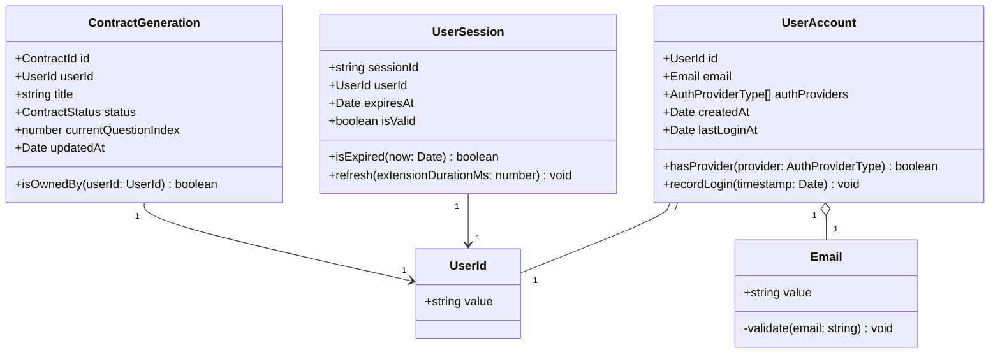
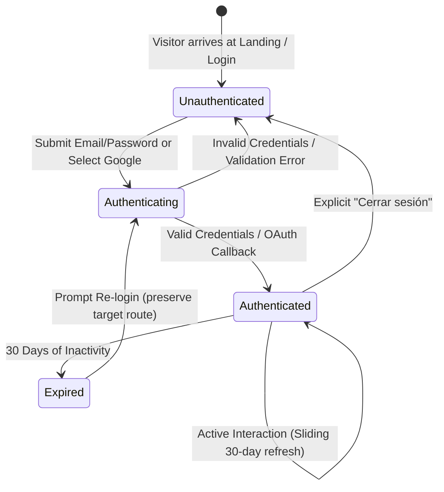
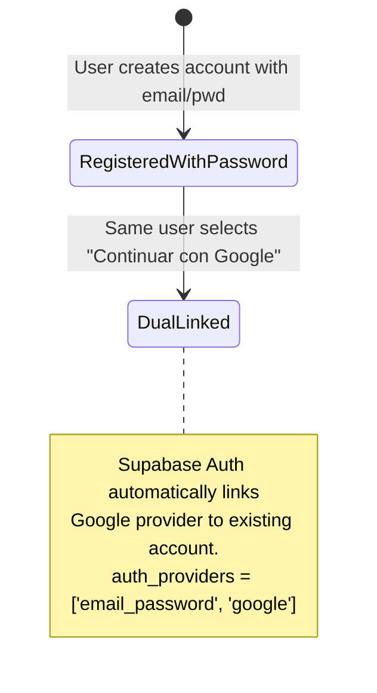

# Data Model: Identity and User Accounts

**Feature**: `001-user-auth`  
**Date**: 2026-09-07  
**Status**: Ready  

---

## 1. Domain Entities & Value Objects (`packages/domain`)

The domain layer encapsulates business logic, invariants, and validation rules without importing database libraries or external frameworks.



### 1.1 `UserAccount` (Aggregate Root)

Represents an individual person registered in the system.

- **Attributes**:
  - `id`: `UserId` — Unique UUID identifier.
  - `email`: `Email` — Unique verified email address value object.
  - `authProviders`: `AuthProviderType[]` — Set of identity providers linked to this account (`'email_password' | 'google'`).
  - `createdAt`: `Date` — Account creation timestamp.
  - `lastLoginAt`: `Date` — Timestamp of the most recent authentication.
- **Invariants & Business Rules**:
  - An account must have at least one valid auth provider.
  - Email addresses must conform to RFC 5322 syntax and be converted to lowercase.
  - Adding an already linked provider is idempotent.
  - Password credentials must meet the complexity policy: minimum 8 characters, maximum 128 characters, non-whitespace.

### 1.2 `UserSession` (Entity)

Represents an active, authenticated user session on a client device.

- **Attributes**:
  - `sessionId`: `string` — Unique session token identifier.
  - `userId`: `UserId` — Reference to the authenticated `UserAccount`.
  - `expiresAt`: `Date` — Session expiry date (set to 30 days from last activity).
  - `isValid`: `boolean` — Invalidation flag (set to false upon explicit logout).
- **Invariants & Business Rules**:
  - A session is expired if `new Date() > expiresAt` or `isValid === false`.
  - Sliding refresh: Any active request extends `expiresAt` by 30 days.

### 1.3 `ContractGeneration` (Entity - User Ownership Boundary)

Represents an ongoing or completed legal contract drafting session.

- **Attributes**:
  - `id`: `ContractId` — Unique UUID identifier.
  - `userId`: `UserId` — Foreign reference to the owning `UserAccount`.
  - `title`: `string` — Contract display name (defaults to "Mi Contrato 1").
  - `status`: `ContractStatus` — Current state (`'in_progress' | 'completed'`).
  - `currentQuestionIndex`: `number` — Zero-indexed questionnaire pointer.
  - `updatedAt`: `Date` — Last modification timestamp.
- **Invariants & Business Rules**:
  - A `ContractGeneration` cannot exist without an owner `userId`.
  - Only the user whose `UserId` matches the contract's `userId` can read, update, or resume the contract.

---

## 2. Database Schema (`Supabase / PostgreSQL`)

### 2.1 Table: `public.user_profiles`

Stores domain profile details linked directly to Supabase Auth's internal table.

```sql
CREATE TABLE public.user_profiles (
    id UUID PRIMARY KEY REFERENCES auth.users(id) ON DELETE CASCADE,
    email VARCHAR(255) NOT NULL UNIQUE,
    auth_providers TEXT[] NOT NULL DEFAULT ARRAY['email_password'::TEXT],
    created_at TIMESTAMPTZ NOT NULL DEFAULT NOW(),
    last_login_at TIMESTAMPTZ NOT NULL DEFAULT NOW()
);

-- RLS: Users can only read and update their own profile
ALTER TABLE public.user_profiles ENABLE ROW LEVEL SECURITY;

CREATE POLICY "Users can view own profile"
    ON public.user_profiles FOR SELECT
    TO authenticated
    USING (auth.uid() = id);

CREATE POLICY "Users can update own profile"
    ON public.user_profiles FOR UPDATE
    TO authenticated
    USING (auth.uid() = id)
    WITH CHECK (auth.uid() = id);
```

### 2.2 Table: `public.contract_generations`

Stores contract creation progress and questionnaire states tied to user accounts.

```sql
CREATE TABLE public.contract_generations (
    id UUID PRIMARY KEY DEFAULT gen_random_uuid(),
    user_id UUID NOT NULL REFERENCES auth.users(id) ON DELETE CASCADE,
    title VARCHAR(255) NOT NULL DEFAULT 'Mi Contrato 1',
    status VARCHAR(50) NOT NULL DEFAULT 'in_progress',
    current_question_index INTEGER NOT NULL DEFAULT 0,
    answers JSONB NOT NULL DEFAULT '{}'::JSONB,
    created_at TIMESTAMPTZ NOT NULL DEFAULT NOW(),
    updated_at TIMESTAMPTZ NOT NULL DEFAULT NOW()
);

-- Index for dashboard listing queries
CREATE INDEX idx_contract_generations_user_id ON public.contract_generations(user_id);
CREATE INDEX idx_contract_generations_updated_at ON public.contract_generations(updated_at DESC);

-- RLS: Complete tenant isolation
ALTER TABLE public.contract_generations ENABLE ROW LEVEL SECURITY;

CREATE POLICY "Users can only read own contract generations"
    ON public.contract_generations FOR SELECT
    TO authenticated
    USING (auth.uid() = user_id);

CREATE POLICY "Users can only insert own contract generations"
    ON public.contract_generations FOR INSERT
    TO authenticated
    WITH CHECK (auth.uid() = user_id);

CREATE POLICY "Users can only update own contract generations"
    ON public.contract_generations FOR UPDATE
    TO authenticated
    USING (auth.uid() = user_id)
    WITH CHECK (auth.uid() = user_id);

CREATE POLICY "Users can only delete own contract generations"
    ON public.contract_generations FOR DELETE
    TO authenticated
    USING (auth.uid() = user_id);
```

---

## 3. State Transitions

### 3.1 Authentication Lifecycle



### 3.2 Account Linking Transition (Clarification Q1)


