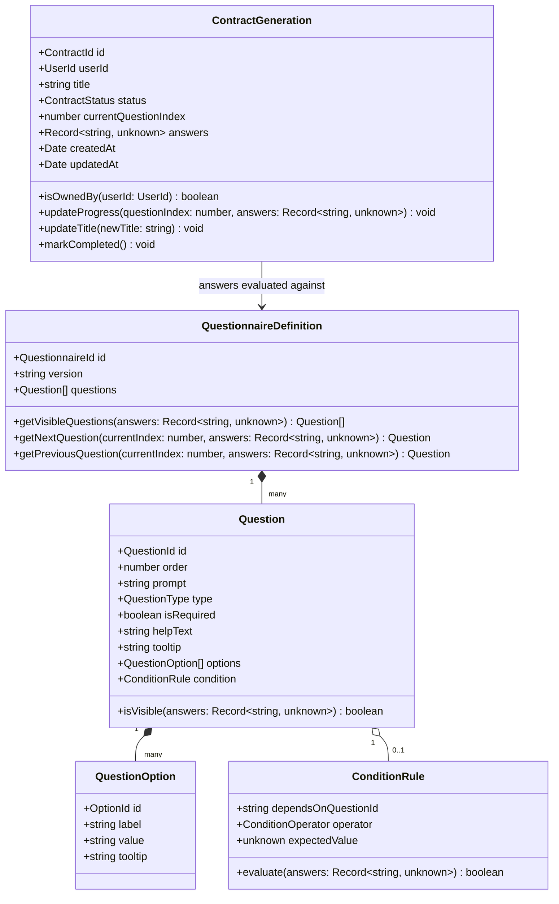
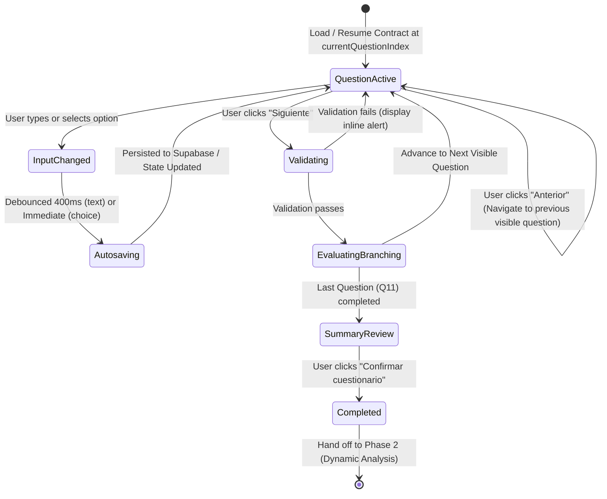
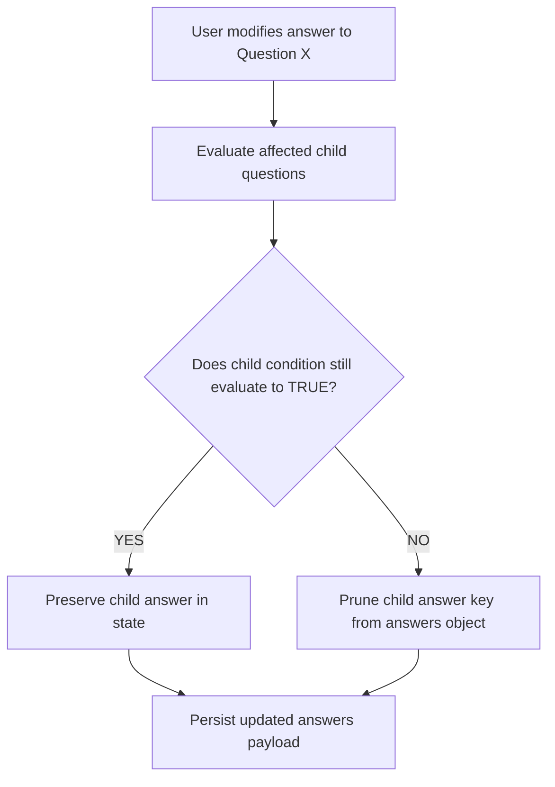

# Data Model: Standard Questionnaire

**Feature**: `002-standard-questionnaire`  
**Date**: 2026-09-08  
**Status**: Ready  

---

## 1. Domain Entities & Value Objects (`packages/domain`)

The domain layer models the questionnaire structure, question types, condition evaluations, and aggregate contract generation state in pure TypeScript.

### 1.1 `QuestionnaireDefinition` (Domain Specification)

Represents the authoritative, ordered catalog of questions and conditional logic for standard contract intake.

- **Attributes**:
  - `id`: `string` — Canonical identifier (e.g., `'standard_questionnaire_v1'`).
  - `version`: `string` — Semantic version (e.g., `'1.0.0'`).
  - `questions`: `Question[]` — Ordered list of standardized questions.
- **Methods & Invariants**:
  - `getVisibleQuestions(answers)`: Computes the filtered ordered list of active questions based on current user answers.
  - `getNextQuestion(currentId, answers)`: Resolves the immediate next active question, skipping questions whose conditions evaluate to false.
  - `getPreviousQuestion(currentId, answers)`: Resolves the immediate preceding active question.

### 1.2 `Question` (Entity / Value Object)

Represents an individual questionnaire step presented to the user.

- **Attributes**:
  - `id`: `string` — Unique question key (e.g., `'q0_description'`, `'q1_legal_personality'`, `'q4_modality'`).
  - `order`: `number` — Display sequence rank.
  - `prompt`: `string` — Spanish prompt displayed to the user.
  - `type`: `QuestionType` — One of `'open_text' | 'single_choice' | 'multiple_choice' | 'checkbox'`.
  - `isRequired`: `boolean` — Whether an answer must be provided before advancing.
  - `helpText`: `string | undefined` — Spanish explanatory text for the expandable "¿Por qué te preguntamos esto?" field.
  - `tooltip`: `string | undefined` — Optional guidance tooltip on the question itself.
  - `options`: `QuestionOption[] | undefined` — Selectable choices for choice questions.
  - `condition`: `ConditionRule | undefined` — Optional rule governing conditional visibility.

### 1.3 `QuestionOption` (Value Object)

Represents a selectable item in a single or multiple choice question.

- **Attributes**:
  - `id`: `string` — Option identifier (e.g., `'opt_individual'`, `'opt_legal_entity'`).
  - `label`: `string` — User-facing Spanish label.
  - `value`: `string` — Underlying canonical value stored in answers.
  - `tooltip`: `string | undefined` — Optional explanation of the specific option (e.g., explaining legal implications).

### 1.4 `ConditionRule` (Value Object)

Encapsulates deterministic visibility conditions.

- **Attributes**:
  - `dependsOnQuestionId`: `string` — Target question key.
  - `operator`: `'equals' | 'not_equals' | 'greater_than' | 'contains' | 'in'`.
  - `expectedValue`: `unknown` — Target comparison value.
- **Evaluation Rules**:
  - Q4a (delivery deadline): `dependsOn: 'q4_modality', operator: 'equals', value: 'one_time'`.
  - Q4b (recurring duration): `dependsOn: 'q4_modality', operator: 'equals', value: 'recurring'`.
  - Q7 (price increase): `dependsOn: 'q4b_duration_months', operator: 'greater_than', value: 12`.
  - Q9a (renewal notice): `dependsOn: 'q9_renewal', operator: 'equals', value: 'automatic_renewal'`.

### 1.5 `ContractGeneration` (Aggregate Root Updates)

Encapsulates the drafting lifecycle, answers, and title updates.

- **Added / Updated Methods**:
  - `updateProgress(questionIndex: number, answers: Record<string, unknown>, now?: Date)`: Updates question position and merges answers.
  - `updateTitle(newTitle: string, now?: Date)`: Renames the contract generation, validating that `newTitle.trim().length > 0`.
  - `pruneObsoleteAnswers(questionnaire: QuestionnaireDefinition)`: Removes keys from `answers` where the corresponding question is no longer visible based on current answers.
  - `markCompleted(now?: Date)`: Sets status to `'completed'` for the standard questionnaire phase.

---

## 2. Standard Question Catalog Specification

| Key | Type | Prompt (Spanish) | Options / Inputs | Condition |
|---|---|---|---|---|
| `q0_description` | `open_text` | Describe el bien o servicio que necesitas | Multi-line text (max 2000 chars) | None (Always active) |
| `q1_legal_personality` | `single_choice` | ¿Eres persona natural o persona jurídica? | 1. Persona natural (tooltip: Persona humana con derechos y obligaciones) 2. Persona jurídica (tooltip: Empresa o sociedad legalmente constituida) | None |
| `q2_delivery_conditions` | `open_text` | ¿Bajo qué condiciones requieres que se entregue el bien o servicio solicitado? | Multi-line text (e.g., vida útil mínima, empaque, estándares técnicos) | None |
| `q3_location` | `open_text` | ¿Cuál es la ubicación del contrato (dirección exacta)? | Single-line / Multi-line text | None |
| `q4_modality` | `single_choice` | ¿El bien o servicio se contrata para una entrega única o es periódico/recurrente en el tiempo? | 1. Entrega única (`one_time`) 2. Periódico o recurrente (`recurring`) | None |
| `q4a_delivery_timeframe` | `open_text` | Plazo o fecha de entrega requerida | Text input | `q4_modality == 'one_time'` |
| `q4b_recurring_duration` | `single_choice` | Duración requerida del contrato | 1. Menor o igual a 12 meses (`<=12`) 2. Mayor a 12 meses (`>12`) | `q4_modality == 'recurring'` |
| `q5_service_profile` | `multiple_choice` | Si se contrata a un proveedor de servicios: Especifica si el proveedor empleará personal o utilizará vehículos | 1. Empleará personal (`employs_people`) 2. Utilizará vehículos (`uses_vehicles`) 3. No aplica / Adquisición de bienes o sin personal ni vehículos (`not_applicable`) | None (Mutually exclusive opt-out) |
| `q6_breach_impact` | `open_text` | ¿De qué manera te afectaría un incumplimiento por parte del proveedor? | Multi-line text | None |
| `q7_price_adjustment` | `single_choice` | Define el mecanismo de incremento de precio | 1. Renegociación entre las partes 2. Índice de Precios al Consumidor (IPC) 3. Salario Mínimo Legal Vigente (SMLMV) 4. Otro mecanismo a especificar | `q4b_recurring_duration == '>12'` |
| `q8_termination_notice` | `single_choice` | Define el plazo de preaviso de terminación que debe otorgar el proveedor | 1. 30 días calendario 2. 60 días calendario 3. 90 días calendario 4. Otro plazo a especificar | None |
| `q9_renewal` | `single_choice` | ¿El contrato tendrá renovación automática o una fecha fija de terminación? | 1. Renovación automática (`automatic_renewal`) 2. Fecha fija de terminación (`fixed_term`) | None |
| `q9a_renewal_notice` | `open_text` | Define el plazo de preaviso requerido para evitar la renovación automática | Text input (e.g., 30 días de anticipación) | `q9_renewal == 'automatic_renewal'` |
| `q10_additional_termination` | `open_text` | Define causales adicionales de terminación anticipada más allá de las legales | Multi-line text | None |
| `q11_dispute_resolution` | `single_choice` | Mecanismo de resolución de controversias | 1. Tribunales ordinarios de justicia 2. Tribunal de arbitramento 3. Centro de conciliación 4. Amigable composición | None |

---

## 3. State Transitions & Lifecycle

### 3.1 Questionnaire Traversal & Persistence

### 3.2 Conditional Answer Pruning Logic

