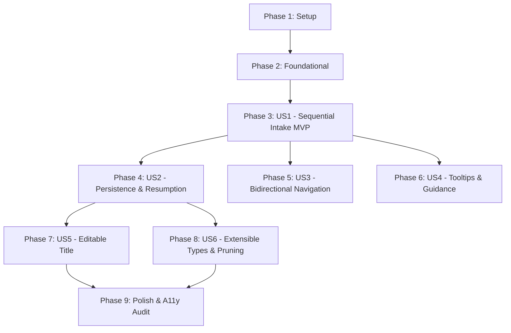

# Tasks: Standard Questionnaire

**Feature**: `002-standard-questionnaire`  
**Spec**: [spec.md](./spec.md) | **Plan**: [plan.md](./plan.md)  
**Date**: 2026-09-08  
**Status**: Ready for Implementation  

---

## Phase 1: Setup (Shared Infrastructure)

**Purpose**: Scaffolding for questionnaire domain directories, application use cases, UI component folders, and Spanish copy catalog

- [ ] T001 [P] Create questionnaire domain entity, value-object, and service subdirectories in `packages/domain/src/entities/`, `packages/domain/src/value-objects/`, and `packages/domain/src/services/`
- [ ] T002 [P] Create application questionnaire use cases and ports directory structure in `packages/application/src/use-cases/questionnaire/` and `packages/application/src/ports/`
- [ ] T003 [P] Create questionnaire UI component directory structure and types in `apps/web/src/components/questionnaire/` and `apps/web/src/components/questionnaire/types/`
- [ ] T004 Extend Spanish localization dictionary (`es.ts`) with all questionnaire strings, prompts (Q0–Q11), option labels, tooltips, "¿Por qué te preguntamos esto?" legal rationales, validation messages, and review labels in `apps/web/src/locales/es.ts`

---

## Phase 2: Foundational (Blocking Prerequisites)

**Purpose**: Core domain value objects, condition rules, error definitions, port contracts, and canonical question catalog

**⚠️ CRITICAL**: No user story work can begin until this phase is complete

- [ ] T005 [P] Implement questionnaire domain errors (`ContractNotFoundError`, `UnauthorizedContractAccessError`, `InvalidAnswerError`, `EmptyTitleError`) in `packages/domain/src/errors/DomainErrors.ts`
- [ ] T006 [P] Implement `QuestionOption` value object with tooltips and values in `packages/domain/src/value-objects/QuestionOption.ts`
- [ ] T007 [P] Implement `ConditionRule` value object with operator evaluation logic (`equals`, `greater_than`, `in`) in `packages/domain/src/value-objects/ConditionRule.ts`
- [ ] T008 [P] Implement `AnswerValue` value object encapsulating validated answer payloads in `packages/domain/src/value-objects/AnswerValue.ts`
- [ ] T009 [P] Define `QuestionnaireEnginePort` interface and DTOs per contract specification in `packages/application/src/ports/QuestionnaireEnginePort.ts`
- [ ] T010 [P] Define `ContractProgressPort` interface and DTOs per contract specification in `packages/application/src/ports/ContractProgressPort.ts`
- [ ] T011 [P] Implement `MockContractRepository` in-memory adapter for unit/contract tests in `packages/infrastructure/src/adapters/storage/MockContractRepository.ts`
- [ ] T012 Implement canonical `QuestionnaireDefinition` domain entity containing the ordered standard questions (Q0–Q11), conditions, validation rules, and dynamic skip-traversal logic in `packages/domain/src/entities/QuestionnaireDefinition.ts`

**Checkpoint**: Foundation ready — user story implementation can now begin.

---

## Phase 3: User Story 1 - Sequential One-Question-at-a-Time Intake Flow (Priority: P1) 🎯 MVP

**Goal**: Deliver a focused, distraction-free intake interface presenting exactly one standard question at a time (Q0 to Q11) in logical sequence, with required validation and completion handoff.

**Independent Test**: Navigate to `/questionnaire`, confirm only Q0 renders, enter description, advance sequentially through all questions to Q11, and confirm transition to the summary review screen.

### Tests for User Story 1 (TDD - Write FIRST, ensure they FAIL) ⚠️

- [ ] T013 [P] [US1] Write failing unit tests for `QuestionnaireDefinition` traversal and required question validation in `packages/domain/tests/QuestionnaireDefinition.test.ts`
- [ ] T014 [P] [US1] Write failing component tests for `QuestionCard` layout rendering only one question at a time in `apps/web/tests/questionnaire/QuestionCard.test.tsx`
- [ ] T015 [P] [US1] Write failing component tests for `SummaryReview` completion screen in `apps/web/tests/questionnaire/SummaryReview.test.tsx`

### Implementation for User Story 1

- [ ] T016 [US1] Implement `Question` domain entity with validation and visibility checks in `packages/domain/src/entities/Question.ts` (satisfies T013)
- [ ] T017 [P] [US1] Implement accessible `QuestionCard` component wrapping active prompt and form controls in `apps/web/src/components/questionnaire/QuestionCard.tsx` (satisfies T014)
- [ ] T018 [P] [US1] Implement `NavigationControls` component with "Siguiente" button, disabled states, and Spanish validation alert (`role="alert"`) in `apps/web/src/components/questionnaire/NavigationControls.tsx`
- [ ] T019 [US1] Implement `SummaryReview` component displaying all answered questions with "Modificar" links and "Confirmar cuestionario" action in `apps/web/src/components/questionnaire/SummaryReview.tsx` (satisfies T015)
- [ ] T020 [US1] Implement `QuestionnaireContainer` coordinating step transitions, single-question rendering, and summary view in `apps/web/src/components/questionnaire/QuestionnaireContainer.tsx`
- [ ] T021 [US1] Wire the host questionnaire page in `apps/web/src/app/(protected)/questionnaire/page.tsx` supporting both `?id=<uuid>` resumption and new contract generation initialization

**Checkpoint**: User Story 1 is fully functional and delivers an independently testable MVP.

---

## Phase 4: User Story 2 - Incremental Persistence and Resumption (Priority: P1)

**Goal**: Automatically persist each answer immediately upon entry so users can leave the questionnaire midway and resume drafting later with 100% of their progress intact.

**Independent Test**: Answer questions Q0–Q3, close browser tab, reopen dashboard, click "Continuar cuestionario", and verify direct restoration to Q4 with all previous answers populated.

### Tests for User Story 2 (TDD - Write FIRST, ensure they FAIL) ⚠️

- [ ] T022 [P] [US2] Write failing unit tests for `UpdateQuestionnaireProgressUseCase` in `packages/application/tests/UpdateQuestionnaireProgressUseCase.test.ts`
- [ ] T023 [P] [US2] Write failing contract tests for `ContractProgressPort.updateProgress` and `getContractById` in `packages/infrastructure/tests/contracts/ContractProgressPort.contract.test.ts`
- [ ] T024 [P] [US2] Write failing integration tests for debounced autosave and mid-session resumption in `apps/web/tests/questionnaire/AutosaveResumption.test.tsx`

### Implementation for User Story 2

- [ ] T025 [US2] Update `ContractGeneration` aggregate with `updateProgress` and JSONB answer merging in `packages/domain/src/entities/ContractGeneration.ts`
- [ ] T026 [US2] Implement `UpdateQuestionnaireProgressUseCase` in `packages/application/src/use-cases/questionnaire/UpdateQuestionnaireProgressUseCase.ts` (satisfies T022)
- [ ] T027 [US2] Implement `CompleteQuestionnaireUseCase` in `packages/application/src/use-cases/questionnaire/CompleteQuestionnaireUseCase.ts`
- [ ] T028 [US2] Implement `updateProgress` and `getContractById` in `SupabaseContractRepository` in `packages/infrastructure/src/adapters/storage/SupabaseContractRepository.ts` (satisfies T023)
- [ ] T029 [P] [US2] Implement API route handler `GET /api/contracts/[id]` in `apps/web/src/app/api/contracts/[id]/route.ts`
- [ ] T030 [P] [US2] Implement API route handler `PATCH /api/contracts/[id]/progress` in `apps/web/src/app/api/contracts/[id]/progress/route.ts`
- [ ] T031 [P] [US2] Implement API route handler `POST /api/contracts/[id]/complete` in `apps/web/src/app/api/contracts/[id]/complete/route.ts`
- [ ] T032 [US2] Implement `useAutosave` hook with 400ms debounce on keystrokes, blur save triggers, and transient local fallback in `apps/web/src/hooks/useAutosave.ts` (satisfies T024)
- [ ] T033 [US2] Connect `useAutosave` and persisted state restoration into `QuestionnaireContainer.tsx` with an accessible "Guardado" status indicator
- [ ] T034 [US2] Update dashboard contract card in `apps/web/src/components/dashboard/ContractList.tsx` to link in-progress contracts directly to `/questionnaire?id=<contractId>`

**Checkpoint**: User Stories 1 AND 2 work together seamlessly with zero data loss on session interruption.

---

## Phase 5: User Story 3 - Bidirectional Navigation and Answer Modification (Priority: P2)

**Goal**: Allow users to navigate backward ("Anterior") to review or revise previously submitted answers, advancing forward again with updated state.

**Independent Test**: Advance to Question 6, click "Anterior" three times to return to Question 3, edit the location address, advance forward, and verify the updated address is persisted while subsequent answers remain intact.

### Tests for User Story 3 (TDD - Write FIRST, ensure they FAIL) ⚠️

- [ ] T035 [P] [US3] Write failing unit tests for backward traversal and answer updates in `packages/domain/tests/BidirectionalNavigation.test.ts`
- [ ] T036 [P] [US3] Write failing component tests for "Anterior" control states in `apps/web/tests/questionnaire/NavigationControls.test.tsx`

### Implementation for User Story 3

- [ ] T037 [US3] Implement `getPreviousQuestion` and `getNextQuestion` backward/forward traversal algorithms that dynamically skip non-matching conditional question indices in `packages/domain/src/entities/QuestionnaireDefinition.ts` (satisfies T035)
- [ ] T038 [US3] Update `NavigationControls` component to show "Anterior" button (hidden on Q0, active on Q1–Q11) with visible focus states in `apps/web/src/components/questionnaire/NavigationControls.tsx` (satisfies T036)
- [ ] T039 [US3] Integrate backward navigation and pre-populated answer editing in `QuestionnaireContainer.tsx`

**Checkpoint**: Users can navigate back and forth freely without losing answers.

---

## Phase 6: User Story 4 - Contextual Guidance, Tooltips, and Expandable Explanations (Priority: P2)

**Goal**: Provide plain-language tooltips for legal terms (e.g., persona natural vs jurídica, provider personnel/vehicles) and an expandable "¿Por qué te preguntamos esto?" section on each question.

**Independent Test**: Focus/hover tooltip on Q1 to verify popover appears with definition; click "¿Por qué te preguntamos esto?" on Q5 to verify smooth expansion and `aria-expanded="true"`.

### Tests for User Story 4 (TDD - Write FIRST, ensure they FAIL) ⚠️

- [ ] T040 [P] [US4] Write failing component tests for `Tooltip` accessibility and keyboard dismiss in `apps/web/tests/questionnaire/Tooltip.test.tsx`
- [ ] T041 [P] [US4] Write failing component tests for `ExpandableHelp` disclosure in `apps/web/tests/questionnaire/ExpandableHelp.test.tsx`

### Implementation for User Story 4

- [ ] T042 [P] [US4] Implement accessible `Tooltip` component using `aria-describedby`, hover/focus triggers, and `Escape` key dismissal in `apps/web/src/components/questionnaire/Tooltip.tsx` (satisfies T040)
- [ ] T043 [P] [US4] Implement accessible `ExpandableHelp` disclosure component with `aria-expanded`, `aria-controls`, and smooth transition in `apps/web/src/components/questionnaire/ExpandableHelp.tsx` (satisfies T041)
- [ ] T044 [US4] Integrate `ExpandableHelp` and contextual `Tooltip` into `QuestionCard.tsx` and choice options

**Checkpoint**: Non-lawyer guidance and accessible legal explanations are operational.

---

## Phase 7: User Story 5 - Editable Default Contract Title (Priority: P3)

**Goal**: Assign an automatic sequential default title ("Mi Contrato N") upon creation and provide an inline editor in the header for renaming at any time.

**Independent Test**: Create two new contracts to verify titles "Mi Contrato 1" and "Mi Contrato 2"; click header title, edit to "Contrato Mantenimiento 2026", and verify immediate persistence; try clearing to blank and verify reversion to previous title.

### Tests for User Story 5 (TDD - Write FIRST, ensure they FAIL) ⚠️

- [ ] T045 [P] [US5] Write failing unit tests for contract title validation and empty title rejection in `packages/domain/tests/ContractTitle.test.ts`
- [ ] T046 [P] [US5] Write failing unit tests for `UpdateTitleUseCase` in `packages/application/tests/UpdateTitleUseCase.test.ts`
- [ ] T047 [P] [US5] Write failing component tests for `InlineTitleEditor` in `apps/web/tests/questionnaire/InlineTitleEditor.test.tsx`

### Implementation for User Story 5

- [ ] T048 [US5] Implement `updateTitle` method with non-empty validation in `packages/domain/src/entities/ContractGeneration.ts` (satisfies T045)
- [ ] T049 [US5] Implement `UpdateTitleUseCase` in `packages/application/src/use-cases/questionnaire/UpdateTitleUseCase.ts` (satisfies T046)
- [ ] T050 [US5] Implement `updateTitle` and `getNextDefaultTitle` in `SupabaseContractRepository` in `packages/infrastructure/src/adapters/storage/SupabaseContractRepository.ts`
- [ ] T051 [P] [US5] Implement API route handler `PATCH /api/contracts/[id]/title` in `apps/web/src/app/api/contracts/[id]/title/route.ts`
- [ ] T052 [P] [US5] Implement accessible `InlineTitleEditor` component with Enter/blur save and empty-value reversion in `apps/web/src/components/questionnaire/InlineTitleEditor.tsx` (satisfies T047)
- [ ] T053 [US5] Implement `QuestionnaireHeader` hosting `InlineTitleEditor` and "Guardar y salir" action in `apps/web/src/components/questionnaire/QuestionnaireHeader.tsx`

**Checkpoint**: Default title assignment and inline editing are verified.

---

## Phase 8: User Story 6 - Extensible Question Types & Dynamic Condition Evaluation (Priority: P3)

**Goal**: Support open text, single choice, multiple choice, and checkbox question types, while dynamically evaluating conditional branches and pruning obsolete child answers.

**Independent Test**: Select "Periódico o recurrente" in Q4, select duration > 12 months, verify Q7 appears and select IPC, navigate back to Q4 and change to "Entrega única", verify Q7 is skipped and IPC answer is pruned from saved state.

### Tests for User Story 6 (TDD - Write FIRST, ensure they FAIL) ⚠️

- [ ] T054 [P] [US6] Write failing unit tests for `ConditionRule` operator evaluation in `packages/domain/tests/ConditionRule.test.ts`
- [ ] T055 [P] [US6] Write failing unit tests for `AnswerPruningService` stripping obsolete answers in `packages/domain/tests/AnswerPruningService.test.ts`
- [ ] T056 [P] [US6] Write failing component tests for polymorphic question renderers in `apps/web/tests/questionnaire/PolymorphicQuestions.test.tsx`

### Implementation for User Story 6

- [ ] T057 [US6] Implement `ConditionRule` evaluation logic in `packages/domain/src/value-objects/ConditionRule.ts` (satisfies T054)
- [ ] T058 [US6] Implement `AnswerPruningService` in `packages/domain/src/services/AnswerPruningService.ts` (satisfies T055)
- [ ] T059 [P] [US6] Implement `OpenTextQuestion` component with character counter and sanitization in `apps/web/src/components/questionnaire/types/OpenTextQuestion.tsx` (satisfies T056)
- [ ] T060 [P] [US6] Implement `SingleChoiceQuestion` component with accessible radio group in `apps/web/src/components/questionnaire/types/SingleChoiceQuestion.tsx` (satisfies T056)
- [ ] T061 [P] [US6] Implement `MultipleChoiceQuestion` component with mutually exclusive "No aplica" logic in `apps/web/src/components/questionnaire/types/MultipleChoiceQuestion.tsx` (satisfies T056)
- [ ] T062 [P] [US6] Implement `CheckboxQuestion` component for boolean toggles in `apps/web/src/components/questionnaire/types/CheckboxQuestion.tsx` (satisfies T056)
- [ ] T063 [US6] Implement `QuestionRenderer` polymorphic dispatcher mapping `QuestionType` to component in `apps/web/src/components/questionnaire/QuestionRenderer.tsx`
- [ ] T064 [US6] Integrate `AnswerPruningService` into `UpdateQuestionnaireProgressUseCase.ts` and `QuestionnaireContainer.tsx`

**Checkpoint**: All 6 user stories are fully implemented and integrated.

---

## Phase 9: Polish & Cross-Cutting Concerns

**Purpose**: Accessibility audit, network resilience, and end-to-end verification

- [ ] T065 [P] Run automated WCAG 2.1 AA accessibility audit across all question types and summary review using axe-core in `apps/web/tests/a11y/questionnaireA11y.test.tsx`
- [ ] T066 [P] Implement `NetworkStatusBanner` showing Spanish warning and retry state during connection loss in `apps/web/src/components/questionnaire/NetworkStatusBanner.tsx`
- [ ] T067 Implement programmatic focus shift to question heading `h2` upon question transition in `apps/web/src/components/questionnaire/QuestionCard.tsx`
- [ ] T068 Execute full automated and manual verification suite documented in `specs/002-standard-questionnaire/quickstart.md`

---

## Dependencies & Execution Order

### Phase Dependencies

- **Setup (Phase 1)**: No dependencies — executes first.
- **Foundational (Phase 2)**: Depends on Phase 1 — BLOCKS all user stories.
- **User Story 1 (P1)**: Depends on Phase 2 — core intake MVP.
- **User Story 2 (P1)**: Depends on US1 — adds incremental autosave and backend persistence.
- **User Story 3 (P2)**: Can proceed in parallel with US4 once US1 completes.
- **User Story 4 (P2)**: Can proceed in parallel with US3 once US1 completes.
- **User Story 5 (P3)**: Depends on US2 (requires persistence API to save title updates).
- **User Story 6 (P3)**: Depends on US2 (requires persistence to store polymorphic answers and pruning).
- **Polish (Phase 9)**: Depends on all user stories being complete.

### Parallel Opportunities

- **Phase 1 Setup**: Tasks `T001`, `T002`, `T003`, `T004` can execute in parallel.
- **Phase 2 Primitives**: Tasks `T005`, `T006`, `T007`, `T008`, `T009`, `T010`, `T011` can execute in parallel.
- **Phase 3 Tests & UI**: Tasks `T013`, `T014`, `T015` can be written in parallel; `T017`, `T018` implemented in parallel.
- **Phase 4 API Handlers**: Tasks `T029`, `T030`, `T031` can be created in parallel.
- **Phase 8 Question Types**: Components `T059`, `T060`, `T061`, `T062` can be created in parallel.
- **Cross-Story Parallelism**: Once US1 and US2 complete, User Story 3 (Navigation), User Story 4 (Tooltips), and User Story 5 (Title) can be worked on concurrently by multiple team members.

---

## Implementation Strategy

### MVP First (Phases 1, 2, and 3)
1. Complete **Phase 1: Setup** (Directories and Spanish dictionary).
2. Complete **Phase 2: Foundational** (Domain primitives, `QuestionnaireDefinition`, ports).
3. Complete **Phase 3: User Story 1** (One-question-at-a-time traversal and summary review).
4. **STOP and VALIDATE**: Verify sequential Q0–Q11 flow in browser.
5. Deploy MVP increment.

### Incremental Feature Expansion
1. Deliver **User Story 2**: Wire incremental autosave and mid-session resumption via Supabase.
2. Deliver **User Story 3**: Enable "Anterior" backward navigation and answer modification.
3. Deliver **User Story 4**: Add accessible tooltips and "¿Por qué te preguntamos esto?" disclosures.
4. Deliver **User Story 5**: Add automatic default title generation and inline header editing.
5. Deliver **User Story 6**: Register modular question types, condition evaluator, and answer pruning service.
6. Deliver **Phase 9**: Run axe-core WCAG 2.1 AA audit and execute `quickstart.md` validation.
