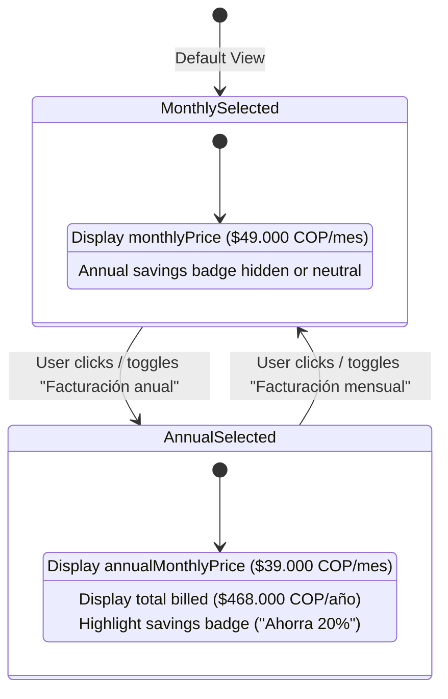

# Phase 1 Data Model: Landing Page

**Feature**: `003-landing-page`  
**Date**: 2026-09-12  
**Status**: Completed  

---

## 1. Domain Entities & Value Objects

### 1.1 `CountryCode` (Value Object)
- **Definition**: Supported ISO 3166-1 alpha-2 country identifier.
- **Values**: `'CO'` (active default), extensible to `'MX' | 'ES' | 'US' | string`.
- **Validation**: 2 uppercase alphabetic ASCII characters.

### 1.2 `BillingCycle` (Value Object)
- **Definition**: The billing frequency selected by the user.
- **Type**: `'monthly' | 'annual'`.
- **Default**: `'monthly'`.

### 1.3 `PricingPlanConfig` (Domain Entity)
- **Definition**: Complete specification of a subscription tier for a specific country/market.
- **Attributes**:
  - `id`: `string` — Unique plan identifier (e.g. `'pro'`).
  - `name`: `string` — Plan title (e.g. `'Plan Pro'`).
  - `tagline`: `string` — Short marketing subtitle.
  - `countryCode`: `CountryCode` — ISO country code this plan belongs to (e.g. `'CO'`).
  - `currency`: `{ symbol: string; code: string; position: 'prefix' | 'suffix' }` — Currency descriptor (e.g. `{ symbol: '$', code: 'COP', position: 'prefix' }`).
  - `monthlyPrice`: `number` — Base price when billed month-to-month (e.g. `49000`).
  - `annualMonthlyPrice`: `number` — Equivalent monthly price when billed annually (e.g. `39000`).
  - `annualTotal`: `number` — Total sum billed upfront for a 12-month commitment (e.g. `468000`).
  - `annualDiscountPercent`: `number` — Percentage savings for annual commitment (e.g. `20`).
  - `freeContractsIncluded`: `number` — Number of contracts generated for free before subscribing (e.g. `3`).
  - `features`: `readonly string[]` — List of actual capability bullets included with the plan.
  - `cta`: `{ label: string; href: string }` — Call-to-action button configuration.
- **Validation Rules**:
  - `monthlyPrice > 0`
  - `annualMonthlyPrice > 0`
  - `annualMonthlyPrice < monthlyPrice`
  - `annualTotal === annualMonthlyPrice * 12`
  - `annualDiscountPercent === Math.round(((monthlyPrice - annualMonthlyPrice) / monthlyPrice) * 100)`
  - `freeContractsIncluded >= 0`
  - `features.length >= 3`

### 1.4 `CountryPricingRegistry` (Domain Entity / Catalog)
- **Definition**: Centralized lookup dictionary mapping country codes to their corresponding `PricingPlanConfig`.
- **Structure**: `Record<CountryCode, PricingPlanConfig>`.
- **Default Country**: `'CO'`.
- **Lookup Method**: `getPlanForCountry(countryCode?: CountryCode): PricingPlanConfig`. If `countryCode` is omitted or unrecognized, gracefully falls back to the default country (`'CO'`).

---

## 2. Presentation Models & Navigation Entities

### 2.1 `WorkflowStep`
- **Definition**: Represents each step displayed in the "Cómo funciona" (How it works) section.
- **Attributes**:
  - `stepNumber`: `1 | 2 | 3` — Sequential step position.
  - `title`: `string` — Step name in Spanish.
  - `description`: `string` — Clear narrative of what happens in this step.
  - `badge`: `string` — Short visual pill tag (e.g. `'Paso 1'`, `'Paso 2'`, `'Paso 3'`).
  - `icon`: `'questionnaire' | 'ai_analysis' | 'download_document'` — Visual icon discriminator.

### 2.2 `LandingNavigationItem`
- **Definition**: Represents in-page anchor links and route navigation.
- **Attributes**:
  - `label`: `string` — Display text in Spanish.
  - `href`: `string` — Target anchor (`'#como-funciona'`, `'#precios'`) or route.
  - `isExternal`: `boolean` — Whether link points outside the web application.

---

## 3. Pure Domain Calculations & Formatting

### 3.1 `PricingCalculatorService`
- **`calculateAnnualSavings(plan: PricingPlanConfig): number`**
  - Formula: `(plan.monthlyPrice * 12) - plan.annualTotal`.
  - For Colombia: `(49.000 * 12) - 468.000 = 588.000 - 468.000 = 120.000 COP`.
- **`formatPrice(amount: number, currency: PricingPlanConfig['currency']): string`**
  - Uses standard Spanish locale number formatting (e.g. `49.000` with periods for thousands separators in Spanish Colombia).
  - Output: `"$ 49.000 COP"`.

---

## 4. State Transitions (Client UI)

