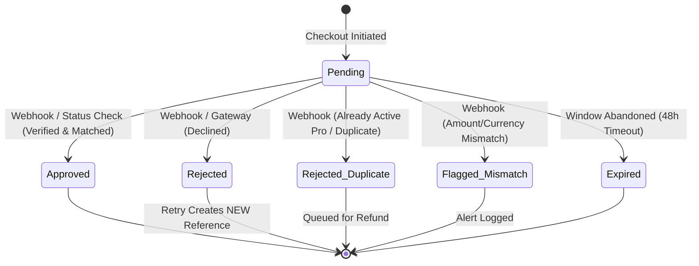
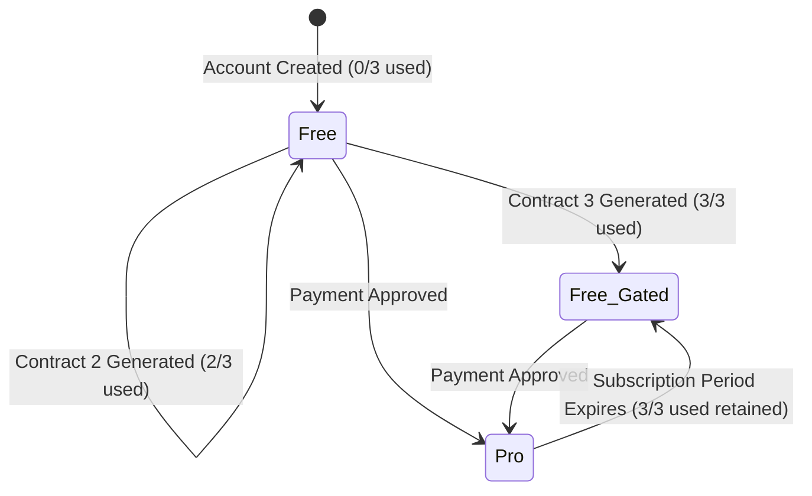

# Phase 1 Data Model: Payment Transactions, Multi-Provider Architecture & Subscriptions

**Feature**: `004-wompi-plan-purchase`  
**Date**: 2026-09-12  
**Status**: Complete  

---

## 1. Domain Entities & Value Objects

### 1.1 `UserSubscription` (Aggregate Root)

Represents a user's subscription entitlement, plan tier, and free contract quota.

```typescript
export type PlanType = 'free' | 'pro';
export type SubscriptionStatus = 'active' | 'expired';

export interface UserSubscriptionProps {
  readonly id: string;
  readonly userId: UserId;
  readonly planType: PlanType;
  readonly status: SubscriptionStatus;
  readonly freeContractsUsed: number;
  readonly startedAt: Date;
  readonly expiresAt: Date | null;
  readonly currentPeriodBillingCycle: BillingCycle | null;
  readonly lastPaymentTransactionId: string | null;
}

export class UserSubscription {
  // Enforces domain invariants:
  // 1. Free tier allows up to 3 contracts.
  // 2. Pro tier permits unlimited contract generation while active.
  // 3. Expired Pro reverts to free plan with lifetime freeContractsUsed preserved.
  // 4. canGenerateContract(): boolean -> true if Pro (active) or Free with freeContractsUsed < 3.
  // 5. canInitiateCheckout(): boolean -> true if on Free plan or expired Pro (blocks active Pro from duplicate purchases).
}
```

### 1.2 `PaymentTransaction` (Entity)

Represents an individual financial transaction attempt through a payment gateway.

```typescript
export type PaymentStatus = 
  | 'pending' 
  | 'approved' 
  | 'rejected' 
  | 'rejected_duplicate' 
  | 'expired' 
  | 'flagged_mismatch';

export interface PaymentTransactionProps {
  readonly id: string;
  readonly userId: UserId;
  readonly providerId: PaymentProviderId;
  readonly reference: string;
  readonly gatewayTransactionId: string | null;
  readonly planId: string;
  readonly billingCycle: BillingCycle;
  readonly amount: number;
  readonly currency: string;
  readonly status: PaymentStatus;
  readonly paymentMethodType: string | null;
  readonly rejectionReason: string | null;
  readonly createdAt: Date;
  readonly updatedAt: Date;
}
```

### 1.3 `PaymentWebhookEvent` (Entity)

Stores incoming webhook event logs for auditability and strict idempotency.

```typescript
export type WebhookProcessingStatus = 
  | 'processed' 
  | 'ignored_duplicate' 
  | 'failed_verification' 
  | 'flagged_mismatch';

export interface PaymentWebhookEventProps {
  readonly id: string;
  readonly eventId: string;
  readonly providerId: PaymentProviderId;
  readonly transactionReference: string;
  readonly eventType: string;
  readonly payload: Record<string, unknown>;
  readonly checksum: string;
  readonly status: WebhookProcessingStatus;
  readonly processedAt: Date;
}
```

### 1.4 `PaymentProviderInfo` & `PaymentProviderRegistry` (Domain Service / Registry)

Enables country-based filtering of multiple payment providers.

```typescript
export type PaymentProviderId = 'wompi' | 'stripe' | 'mercadopago' | string;

export interface PaymentProviderInfo {
  readonly id: PaymentProviderId;
  readonly name: string;
  readonly description: string;
  readonly supportedCountries: readonly CountryCode[];
  readonly supportedPaymentMethods: readonly string[];
  readonly logoKey: string;
  readonly isDefault: boolean;
}

export class PaymentProviderRegistry {
  private static readonly providers: Map<PaymentProviderId, PaymentProviderInfo> = new Map([
    [
      'wompi',
      {
        id: 'wompi',
        name: 'Wompi (Bancolombia)',
        description: 'PSE, Tarjetas de crédito y débito, Nequi y transferencias Bancolombia',
        supportedCountries: ['CO'],
        supportedPaymentMethods: ['PSE', 'CARD', 'NEQUI', 'BANCOLOMBIA_TRANSFER'],
        logoKey: 'wompi',
        isDefault: true,
      },
    ],
  ]);

  static getProvidersForCountry(countryCode: CountryCode = 'CO'): PaymentProviderInfo[] {
    const normalized = countryCode.toUpperCase();
    return Array.from(this.providers.values()).filter(p => 
      p.supportedCountries.includes(normalized)
    );
  }

  static getProvider(id: PaymentProviderId): PaymentProviderInfo | undefined {
    return this.providers.get(id);
  }

  static registerProvider(provider: PaymentProviderInfo): void {
    this.providers.set(provider.id, provider);
  }
}
```

---

## 2. State Transition Diagrams

### 2.1 Payment Transaction Lifecycle



### 2.2 User Subscription Lifecycle



---

## 3. Database Schema (Supabase / PostgreSQL)

```sql
-- Migration: 0003_payment_subscriptions.sql

-- 1. Table: user_subscriptions
CREATE TABLE IF NOT EXISTS public.user_subscriptions (
    id UUID PRIMARY KEY DEFAULT gen_random_uuid(),
    user_id UUID NOT NULL REFERENCES auth.users(id) ON DELETE CASCADE,
    plan_type VARCHAR(50) NOT NULL DEFAULT 'free',
    status VARCHAR(50) NOT NULL DEFAULT 'active',
    free_contracts_used INTEGER NOT NULL DEFAULT 0,
    started_at TIMESTAMPTZ NOT NULL DEFAULT NOW(),
    expires_at TIMESTAMPTZ,
    current_period_billing_cycle VARCHAR(20),
    last_payment_transaction_id UUID,
    created_at TIMESTAMPTZ NOT NULL DEFAULT NOW(),
    updated_at TIMESTAMPTZ NOT NULL DEFAULT NOW(),
    CONSTRAINT uq_user_subscriptions_user_id UNIQUE (user_id)
);

CREATE INDEX IF NOT EXISTS idx_user_subscriptions_user_id ON public.user_subscriptions(user_id);
CREATE INDEX IF NOT EXISTS idx_user_subscriptions_expires_at ON public.user_subscriptions(expires_at);

-- RLS for user_subscriptions
ALTER TABLE public.user_subscriptions ENABLE ROW LEVEL SECURITY;

CREATE POLICY "Users can view own subscription"
    ON public.user_subscriptions FOR SELECT
    TO authenticated
    USING (auth.uid() = user_id);

-- 2. Table: payment_transactions
CREATE TABLE IF NOT EXISTS public.payment_transactions (
    id UUID PRIMARY KEY DEFAULT gen_random_uuid(),
    user_id UUID NOT NULL REFERENCES auth.users(id) ON DELETE CASCADE,
    provider_id VARCHAR(50) NOT NULL DEFAULT 'wompi',
    reference VARCHAR(100) NOT NULL UNIQUE,
    gateway_transaction_id VARCHAR(100),
    plan_id VARCHAR(50) NOT NULL DEFAULT 'pro',
    billing_cycle VARCHAR(20) NOT NULL,
    amount INTEGER NOT NULL,
    currency VARCHAR(10) NOT NULL DEFAULT 'COP',
    status VARCHAR(50) NOT NULL DEFAULT 'pending',
    payment_method_type VARCHAR(50),
    rejection_reason TEXT,
    redirect_url TEXT,
    created_at TIMESTAMPTZ NOT NULL DEFAULT NOW(),
    updated_at TIMESTAMPTZ NOT NULL DEFAULT NOW()
);

CREATE INDEX IF NOT EXISTS idx_payment_transactions_user_id ON public.payment_transactions(user_id);
CREATE INDEX IF NOT EXISTS idx_payment_transactions_reference ON public.payment_transactions(reference);
CREATE INDEX IF NOT EXISTS idx_payment_transactions_status ON public.payment_transactions(status);

-- RLS for payment_transactions
ALTER TABLE public.payment_transactions ENABLE ROW LEVEL SECURITY;

CREATE POLICY "Users can view own transactions"
    ON public.payment_transactions FOR SELECT
    TO authenticated
    USING (auth.uid() = user_id);

-- 3. Table: payment_webhook_events
CREATE TABLE IF NOT EXISTS public.payment_webhook_events (
    id UUID PRIMARY KEY DEFAULT gen_random_uuid(),
    event_id VARCHAR(150) NOT NULL UNIQUE,
    provider_id VARCHAR(50) NOT NULL DEFAULT 'wompi',
    transaction_reference VARCHAR(100),
    event_type VARCHAR(100) NOT NULL,
    payload JSONB NOT NULL,
    checksum VARCHAR(255),
    status VARCHAR(50) NOT NULL,
    processed_at TIMESTAMPTZ NOT NULL DEFAULT NOW()
);

CREATE INDEX IF NOT EXISTS idx_webhook_events_event_id ON public.payment_webhook_events(event_id);
CREATE INDEX IF NOT EXISTS idx_webhook_events_reference ON public.payment_webhook_events(transaction_reference);
```
