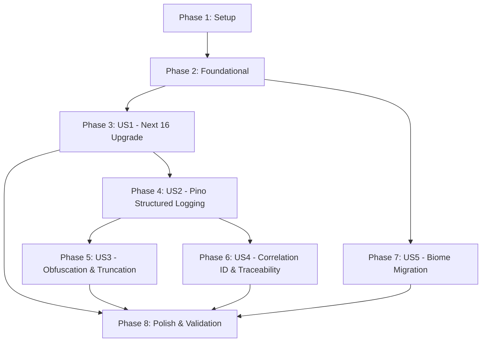

# Implementation Tasks: Next.js LTS Upgrade, Server-Side Logging & Biome Toolchain

**Feature**: Next.js LTS Upgrade, Server-Side Logging & Biome Toolchain  
**Branch**: `005-next-lts-logging-biome` | **Date**: 2026-09-14 | **Spec**: [spec.md](./spec.md) | **Plan**: [plan.md](./plan.md)

---

## Phase 1: Setup (Shared Infrastructure & Dependencies)

**Purpose**: Monorepo environment initialization, package updates, and build toolchain configuration.

- [X] T001 Update Node.js runtime version to "24" in `netlify.toml`
- [X] T002 [P] Install `@biomejs/biome` in root `package.json` and configure `biome.json`
- [X] T003 [P] Add `pino` and `pino-pretty` dependencies to `packages/infrastructure/package.json`
- [X] T004 Upgrade `next` to `^16.x`, `react` and `react-dom` to `^19.x`, `@types/react` and `@types/react-dom` to `^19.x`, and `@testing-library/react` to `^16.x` in `apps/web/package.json`

---

## Phase 2: Foundational (Blocking Prerequisites)

**Purpose**: Core architectural ports and async context management that MUST be in place before user story implementation.

**⚠️ CRITICAL**: All user story phases depend on the completion of this foundational phase.

- [X] T005 [P] Define `LoggerPort` interface in `packages/application/src/ports/logger.port.ts`
- [X] T006 [P] Define `CorrelationContextPort` interface in `packages/application/src/ports/correlation.port.ts`
- [X] T007 [P] Implement `CorrelationStorage` using Node.js `AsyncLocalStorage` in `packages/infrastructure/src/logging/correlation-storage.ts`
- [X] T008 Export logging and correlation ports in `packages/application/src/index.ts` and `packages/infrastructure/src/index.ts`

**Checkpoint**: Foundation ready — user story implementations can now proceed.

---

## Phase 3: User Story 1 - Active LTS Framework Modernization (Priority: P1) 🎯 MVP

**Goal**: Upgrade the web application to Next.js 16 Active LTS and Node.js 24, adopting asynchronous request APIs and Turbopack compiler.

**Independent Test**: Run `pnpm build` and `pnpm test` in `apps/web`, confirming successful compilation with Turbopack and zero deprecation warnings on cookie/header access.

### Tests for User Story 1

- [X] T009 [P] [US1] Create unit tests for asynchronous cookie access in `apps/web/tests/lib/async-cookies.test.ts`

### Implementation for User Story 1

- [X] T010 [US1] Update `apps/web/next.config.mjs` for Next.js 16 Turbopack compatibility
- [X] T011 [US1] Convert `getServerAuthAdapter` in `apps/web/src/lib/auth.ts` to asynchronous `await cookies()` access
- [X] T012 [P] [US1] Convert contract repository factory in `apps/web/src/lib/contracts.ts` to asynchronous `await cookies()` access
- [X] T013 [P] [US1] Convert payment repository factory in `apps/web/src/lib/payments.ts` to asynchronous `await cookies()` access
- [X] T014 [P] [US1] Convert subscription repository factory in `apps/web/src/lib/subscription.ts` to asynchronous `await cookies()` access
- [X] T015 [US1] Update dynamic route handlers in `apps/web/src/app/api/contracts/[id]/route.ts` to `await params`
- [X] T016 [US1] Verify monorepo build and unit tests pass on Next.js 16 by running `pnpm --filter @go-agree/web build`

**Checkpoint**: User Story 1 is functional and verifiable independently.

---

## Phase 4: User Story 2 - Contextual Structured Server-Side Logging with Pino (Priority: P1)

**Goal**: Deliver structured JSON logging with configurable severity thresholds and dual output formatting (pretty in dev, raw JSON in prod).

**Independent Test**: Execute API calls under different `LOG_LEVEL` environment settings, verifying output format and severity threshold filtering on stdout.

### Tests for User Story 2

- [X] T017 [P] [US2] Write unit tests for severity filtering and dual stream formatting in `packages/infrastructure/tests/logging/pino-logger.test.ts`

### Implementation for User Story 2

- [X] T018 [US2] Implement `PinoLoggerAdapter` satisfying `LoggerPort` in `packages/infrastructure/src/logging/pino-logger.adapter.ts`
- [X] T019 [US2] Implement dual transport stream (colorized pretty format for `NODE_ENV=development`, raw JSON for production) in `packages/infrastructure/src/logging/transport.ts`
- [X] T020 [US2] Implement server logger singleton binding ambient `AsyncLocalStorage` in `apps/web/src/lib/logger.ts`
- [X] T021 [US2] Integrate structured logging into critical API routes (`auth`, `contracts`, `checkout`) in `apps/web/src/app/api`

**Checkpoint**: User Stories 1 AND 2 are functional and testable independently.

---

## Phase 5: User Story 3 - Sensitive Data Obfuscation & Log Length Guardrails (Priority: P1)

**Goal**: Automatically redact sensitive data (passwords, tokens, secrets) up to 5 levels deep and truncate oversized payload strings without breaking JSON structure.

**Independent Test**: Pass objects containing credentials and strings exceeding `LOG_MAX_LENGTH`, confirming `[REDACTED]` masking and `... [TRUNCATED]` indicators.

### Tests for User Story 3

- [X] T022 [P] [US3] Write unit tests for 5-level deep recursion, cycle detection, and string truncation in `packages/infrastructure/tests/logging/log-sanitizer.test.ts`

### Implementation for User Story 3

- [X] T023 [US3] Implement `LogSanitizer` with recursive traversal (depth limit: 5) and `WeakSet` circular reference guard in `packages/infrastructure/src/logging/log-sanitizer.ts`
- [X] T024 [US3] Implement field-level string truncation respecting `LOG_MAX_LENGTH` with `... [TRUNCATED]` marker in `packages/infrastructure/src/logging/log-sanitizer.ts`
- [X] T025 [US3] Integrate `LogSanitizer` into `PinoLoggerAdapter` serialization pipeline in `packages/infrastructure/src/logging/pino-logger.adapter.ts`
- [X] T026 [US3] Implement environment variable parsing for `LOG_OBFUSCATE_KEYS`, `LOG_OBFUSCATION_ENABLED`, and `LOG_MAX_LENGTH` in `packages/infrastructure/src/logging/config.ts`

**Checkpoint**: User Stories 1, 2, AND 3 operate together with full privacy guardrails.

---

## Phase 6: User Story 4 - Request Correlation & User/Contract Traceability (Priority: P2)

**Goal**: Propagate `x-correlation-id` across requests and server logs, attributing events to `userId` and `contractId`, and embedding correlation IDs into API error response bodies.

**Independent Test**: Send an HTTP request with or without `x-correlation-id` and trigger an error; verify that response headers, error response body, and log outputs share the same correlation ID.

### Tests for User Story 4

- [X] T027 [P] [US4] Write integration tests for correlation ID extraction and error payload serialization in `apps/web/tests/api/correlation.test.ts`

### Implementation for User Story 4

- [X] T028 [US4] Update `apps/web/src/middleware.ts` to extract or generate `x-correlation-id` and bind to incoming request headers
- [X] T029 [US4] Create standardized API error helper returning `ApiErrorResponsePayload` with `correlationId` in `apps/web/src/lib/api-error.ts`
- [X] T030 [US4] Update API route handlers in `apps/web/src/app/api/**/*.ts` to populate `userId` and `contractId` in correlation storage
- [X] T031 [US4] Update API route error handlers to use the standardized error helper returning `correlationId` in response bodies

**Checkpoint**: Full end-to-end request correlation and user/contract traceability is verified.

---

## Phase 7: User Story 5 - Toolchain Consolidation with Biome (Priority: P2)

**Goal**: Replace Prettier and ESLint with Biome across monorepo workspaces, achieving $< 3$ second lint and format execution.

**Independent Test**: Run `pnpm check`, `pnpm format`, and `pnpm lint`, confirming zero errors/warnings and complete removal of legacy lint tools.

### Implementation for User Story 5

- [X] T032 [P] [US5] Remove legacy `.eslintrc*`, `.prettierrc*`, and ESLint/Prettier dependencies from root and workspace `package.json` files
- [X] T033 [US5] Configure formatting and linting rules (2 spaces, single quotes, 100 character width) in `biome.json`
- [X] T034 [US5] Update script commands (`lint`, `format`, `check`) in root `package.json` and workspace `package.json` files to use Biome CLI
- [X] T035 [US5] Execute `pnpm format` and `pnpm check` across all packages and fix any formatting/linting deviations

**Checkpoint**: Monorepo static analysis and formatting executes entirely through Biome with zero warnings.

---

## Phase 8: Polish & Cross-Cutting Concerns

**Purpose**: Final validation, documentation updates, and compliance confirmation.

- [X] T036 [P] Update environment variable documentation in `apps/web/.env.example` with logging and obfuscation variables
- [X] T037 Execute all quickstart verification scenarios in `specs/005-next-lts-logging-biome/quickstart.md`
- [X] T038 Run full monorepo test suite `pnpm test` and verify 100% pass rate across all packages

---

## Dependencies & Execution Order

### Phase Dependencies

- **Phase 1 (Setup)**: No dependencies — executes immediately.
- **Phase 2 (Foundational)**: Depends on Phase 1 — BLOCKS all user stories.
- **Phase 3 (User Story 1 - Framework)**: Depends on Phase 2.
- **Phase 4 (User Story 2 - Logging)**: Depends on Phase 2 & Phase 3.
- **Phase 5 (User Story 3 - Obfuscation)**: Depends on Phase 4.
- **Phase 6 (User Story 4 - Correlation)**: Depends on Phase 2 & Phase 4.
- **Phase 7 (User Story 5 - Biome)**: Independent of runtime; can execute in parallel with Phases 3–6.
- **Phase 8 (Polish)**: Depends on completion of all user story phases.

### User Story Dependencies

### Parallel Opportunities

- **Setup Phase**: T002 (Biome setup) and T003 (Pino deps) can run concurrently.
- **Foundational Phase**: T005, T006, and T007 can be authored concurrently across different files.
- **User Story 1**: Cookie conversion tasks (T012, T013, T014) can execute in parallel across separate files.
- **User Story 5**: Biome migration (T032, T033) can proceed in parallel with runtime upgrade tasks.

---

## Implementation Strategy

### MVP Scope (Phases 1, 2, and 3)
1. Complete Setup and Foundational prerequisites.
2. Complete User Story 1 (Next.js 16 Active LTS upgrade, Node 24 runtime, async cookies).
3. Validate with `pnpm build` and `pnpm test`.

### Incremental Rollout
* **Increment 1**: Framework modernized on Next.js 16 (MVP).
* **Increment 2**: Core Pino structured logging added (US2).
* **Increment 3**: Obfuscation and length guardrails active (US3).
* **Increment 4**: Distributed correlation context & API error envelopes active (US4).
* **Increment 5**: Biome toolchain unified across monorepo (US5).
