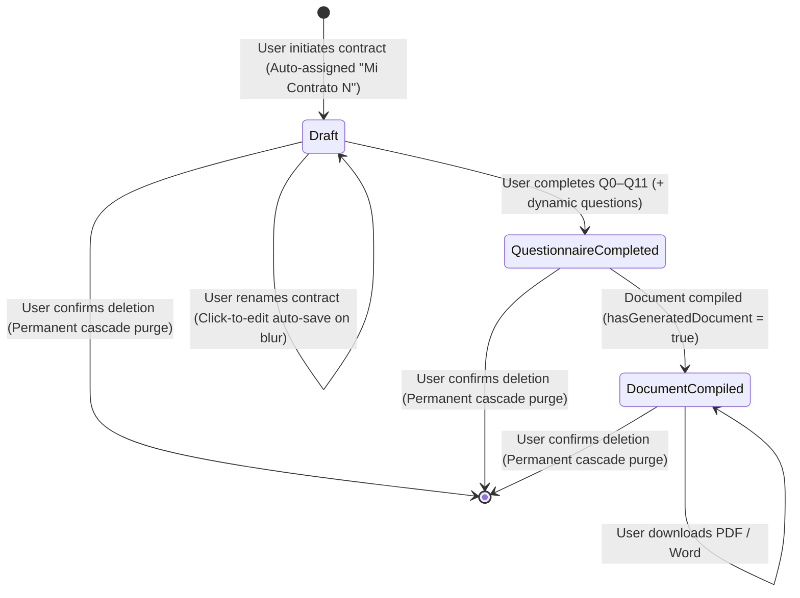

# Data Model Specification: Contract Dashboard

**Branch**: `006-contract-dashboard` | **Date**: 2026-09-15 | **Spec**: [spec.md](./spec.md)

---

## 1. Domain Entities & Value Objects

### 1.1 `ContractGeneration` (Aggregate Root)
Represents the contract generation lifecycle, state, questionnaire answers, and ownership.

- **Attributes**:
  - `id: ContractId` (Value Object, UUID prefixed or raw UUID): Unique contract generation identifier.
  - `userId: UserId` (Value Object, UUID prefixed or raw UUID): Owning authenticated user identifier.
  - `title: string`: User-visible title (e.g., "Mi Contrato 1", "Contrato Arriendo"), minimum 1 character, max 255 characters.
  - `status: 'in_progress' | 'completed'`: Lifecycle state of the generation.
  - `currentQuestionIndex: number`: Highest question reached in the questionnaire sequence.
  - `answers: Record<string, unknown>`: Key-value map of submitted answers (standard Q0–Q11 + dynamic questions).
  - `createdAt: Date`: Creation timestamp.
  - `updatedAt: Date`: Last modification timestamp.

- **Domain Rules & Invariants**:
  - `title` must be non-empty and non-whitespace (`EmptyTitleError` thrown if empty).
  - Only the owning user can access, rename, resume, or delete the contract (`DomainAuthError` thrown on tenant mismatch).
  - Deleting a contract generation aggregate permanently removes all associated state and dynamic questions.

---

### 1.2 `ContractDocument` (Entity)
Represents a compiled, finalized legal document artifact associated with a completed contract generation.

- **Attributes**:
  - `id: string`: Unique document artifact identifier (UUID).
  - `contractId: string`: Parent contract generation identifier.
  - `userId: string`: Owning user identifier.
  - `fileFormat: 'docx' | 'pdf'`: Format of the generated document file.
  - `storagePath: string`: Internal storage key or URI where the compiled file is located.
  - `createdAt: Date`: Generation timestamp.

- **Domain Rules & Invariants**:
  - A contract document can only exist for a contract generation that has reached completion or document compilation.
  - Deleting the parent `ContractGeneration` automatically deletes all associated `ContractDocument` records via foreign key cascade (`ON DELETE CASCADE`).

---

### 1.3 `ContractDashboardItemDTO` (Presentation View Model / Projection)
Projected data transfer object optimized for the Contract Dashboard table/cards view.

```typescript
export interface ContractDashboardItemDTO {
  id: string;
  userId: string;
  title: string;
  status: 'in_progress' | 'completed';
  currentQuestionIndex: number;
  questionsAnsweredCount: number;
  hasGeneratedDocument: boolean;
  availableFormats: ('pdf' | 'docx')[];
  createdAt: Date;
  updatedAt: Date;
}
```

- **Field Semantics**:
  - `questionsAnsweredCount`: Calculated server-side as the count of valid answered entries present in `answers` (standard + dynamic).
  - `hasGeneratedDocument`: `true` if at least one compiled document artifact exists for this contract; `false` otherwise.
  - `availableFormats`: List of available export formats, e.g. `['pdf', 'docx']` when generated, or `[]` when draft.
  - `updatedAt`: Used for default sorting in descending order (most recently edited first).

---

## 2. Database Schema & Tables (Supabase / PostgreSQL)

### 2.1 Existing Table: `public.contract_generations`
```sql
CREATE TABLE IF NOT EXISTS public.contract_generations (
    id UUID PRIMARY KEY DEFAULT gen_random_uuid(),
    user_id UUID NOT NULL REFERENCES auth.users(id) ON DELETE CASCADE,
    title VARCHAR(255) NOT NULL DEFAULT 'Mi Contrato 1',
    status VARCHAR(50) NOT NULL DEFAULT 'in_progress',
    current_question_index INTEGER NOT NULL DEFAULT 0,
    answers JSONB NOT NULL DEFAULT '{}'::JSONB,
    analysis_snapshots JSONB NOT NULL DEFAULT '{}'::JSONB,
    created_at TIMESTAMPTZ NOT NULL DEFAULT NOW(),
    updated_at TIMESTAMPTZ NOT NULL DEFAULT NOW()
);

CREATE INDEX IF NOT EXISTS idx_contract_generations_user_id ON public.contract_generations(user_id);
CREATE INDEX IF NOT EXISTS idx_contract_generations_updated_at ON public.contract_generations(updated_at DESC);
```

### 2.2 Table: `public.contract_documents`
```sql
CREATE TABLE IF NOT EXISTS public.contract_documents (
    id UUID PRIMARY KEY DEFAULT gen_random_uuid(),
    contract_id UUID NOT NULL REFERENCES public.contract_generations(id) ON DELETE CASCADE,
    user_id UUID NOT NULL REFERENCES auth.users(id) ON DELETE CASCADE,
    file_format VARCHAR(20) NOT NULL, -- 'pdf' | 'docx'
    storage_path TEXT NOT NULL,
    created_at TIMESTAMPTZ NOT NULL DEFAULT NOW(),
    CONSTRAINT uq_contract_document_format UNIQUE (contract_id, file_format)
);

CREATE INDEX IF NOT EXISTS idx_contract_documents_contract_id ON public.contract_documents(contract_id);
CREATE INDEX IF NOT EXISTS idx_contract_documents_user_id ON public.contract_documents(user_id);

ALTER TABLE public.contract_documents ENABLE ROW LEVEL SECURITY;

CREATE POLICY "Users can view own documents"
    ON public.contract_documents FOR SELECT
    TO authenticated
    USING (auth.uid() = user_id);

CREATE POLICY "Users can delete own documents"
    ON public.contract_documents FOR DELETE
    TO authenticated
    USING (auth.uid() = user_id);
```

---

## 3. Entity Lifecycle & State Transitions



---

## 4. UI Data Projection Logic

```typescript
export function projectToDashboardItem(
  generation: ContractGenerationDTO,
  documents: ContractDocument[] = []
): ContractDashboardItemDTO {
  const answeredCount = Object.keys(generation.answers || {}).filter(
    (key) => {
      const val = generation.answers[key];
      return val !== null && val !== undefined && val !== '';
    }
  ).length;

  const contractDocs = documents.filter((doc) => doc.contractId === generation.id);
  const hasGeneratedDocument = contractDocs.length > 0;
  const availableFormats = contractDocs.map((d) => d.fileFormat as 'pdf' | 'docx');

  return {
    id: generation.id,
    userId: generation.userId,
    title: generation.title,
    status: generation.status,
    currentQuestionIndex: generation.currentQuestionIndex,
    questionsAnsweredCount: answeredCount,
    hasGeneratedDocument,
    availableFormats,
    createdAt: generation.createdAt,
    updatedAt: generation.updatedAt,
  };
}
```
