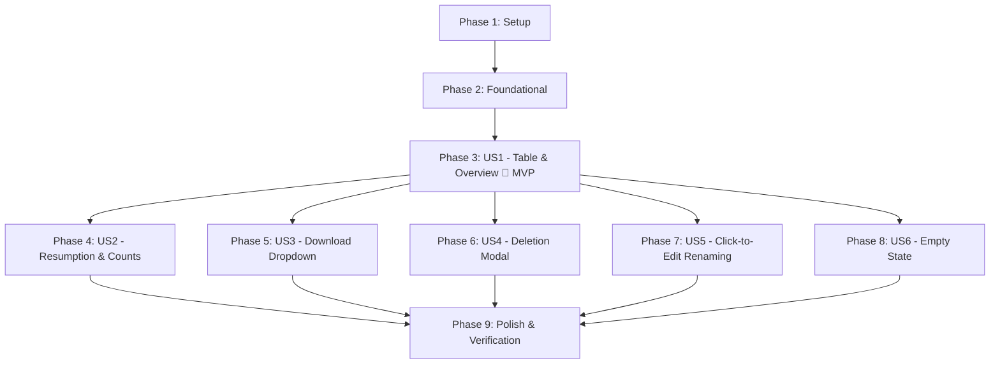

# Implementation Tasks: Contract Dashboard

**Branch**: `006-contract-dashboard` | **Date**: 2026-09-15 | **Spec**: [spec.md](./spec.md) | **Plan**: [plan.md](./plan.md)

---

## Phase 1: Setup (Shared Infrastructure)

**Purpose**: Project initialization, types, DTO contracts, and centralized localization keys.

- [X] T001 [P] Define `ContractDashboardItemDTO` and extend `ContractRepositoryPort` in `packages/application/src/ports/ContractRepositoryPort.ts`
- [X] T002 [P] Export new dashboard types and DTOs in `packages/application/src/index.ts`
- [X] T003 [P] Add Spanish localization keys for dashboard table columns, empty state, download options, and delete confirmation modal in `apps/web/src/locales/es.ts`

---

## Phase 2: Foundational (Blocking Prerequisites)

**Purpose**: Core storage methods and application use cases that MUST be completed before User Story UI implementation.

**⚠️ CRITICAL**: All user story UI tasks depend on this foundational data access layer.

- [X] T004 [P] Create database migration for `contract_documents` with cascade deletion and RLS in `packages/infrastructure/src/supabase/migrations/0004_contract_documents.sql`
- [X] T005 [P] Implement `deleteByIdAndUserId` and `listDashboardItemsByUserId` in `packages/infrastructure/src/adapters/storage/MockContractRepository.ts`
- [X] T006 Implement `deleteByIdAndUserId` and `listDashboardItemsByUserId` with answer counting and document presence in `packages/infrastructure/src/adapters/storage/SupabaseContractRepository.ts`
- [X] T007 [P] Create `DeleteContractUseCase` in `packages/application/src/use-cases/contracts/DeleteContractUseCase.ts`
- [X] T008 Export `DeleteContractUseCase` in `packages/application/src/index.ts`
- [X] T009 Implement `DELETE /api/contracts/[id]` route handler with authentication and error handling in `apps/web/src/app/api/contracts/[id]/route.ts`

**Checkpoint**: Foundation ready — contract deletion, dashboard querying, and localization infrastructure in place.

---

## Phase 3: User Story 1 - Contract Generations Overview & Chronological Listing (Priority: P1) 🎯 MVP

**Goal**: Authenticated user sees all their contract generations in a 6-column table (desktop) or adaptive cards (mobile) sorted by last modified date descending.

**Independent Test**: Load `/dashboard` with mock contracts in multiple states; verify that all 6 columns (**Título**, **Preguntas respondidas**, **Descargar**, **Fecha de creación**, **Última modificación**, **Acciones**) render, sorted by `updatedAt` descending with localized Spanish dates.

### Tests for User Story 1 ⚠️

> **NOTE: Write these tests FIRST, ensure they FAIL before implementation (Constitution Principle III)**

- [X] T010 [P] [US1] Unit test for `calculateAnsweredQuestionsCount` utility in `packages/domain/tests/progressCalculator.test.ts`
- [X] T011 [P] [US1] Unit test for `ListUserContractsUseCase` returning sorted `ContractDashboardItemDTO` items in `packages/application/tests/ListUserContractsUseCase.test.ts`
- [X] T012 [P] [US1] Component test for `ContractList` rendering 6 columns and descending sort in `apps/web/tests/components/ContractList.test.tsx`

### Implementation for User Story 1

- [X] T013 [P] [US1] Implement `calculateAnsweredQuestionsCount` domain utility in `packages/domain/src/utils/progressCalculator.ts`
- [X] T014 [P] [US1] Export `calculateAnsweredQuestionsCount` in `packages/domain/src/index.ts`
- [X] T015 [US1] Update `ListUserContractsUseCase` to return `ContractDashboardItemDTO[]` sorted by `updatedAt` descending in `packages/application/src/use-cases/contracts/ContractUseCases.ts`
- [X] T016 [P] [US1] Create `ContractTableRow.tsx` rendering semantic `<tr>` row with 6 columns in `apps/web/src/components/dashboard/ContractTableRow.tsx`
- [X] T017 [US1] Refactor `ContractList.tsx` to render semantic `<table>` on desktop and stacked card list on mobile in `apps/web/src/components/dashboard/ContractList.tsx`
- [X] T018 [US1] Update `apps/web/src/app/(protected)/dashboard/page.tsx` to pass `ContractDashboardItemDTO[]` to `ContractList`

**Checkpoint**: User Story 1 MVP fully functional — user sees all contract generations in a sorted, responsive table with all 6 columns.

---

## Phase 4: User Story 2 - Resuming In-Progress Contracts & Inspecting Completed Summaries (Priority: P1)

**Goal**: Clicking an in-progress contract resumes the questionnaire at the exact unanswered question; clicking a completed contract navigates to response summary; "Preguntas respondidas" displays simple count.

**Independent Test**: Click an incomplete contract and verify navigation to `/questionnaire?id={id}`; click a completed contract and verify navigation to `/questionnaire?id={id}&mode=summary`; verify the "Preguntas respondidas" column displays localized count (e.g., "5 respondidas").

### Tests for User Story 2 ⚠️

- [X] T019 [P] [US2] Component tests for resumption links and "Preguntas respondidas" simple count formatting in `apps/web/tests/components/ContractResumption.test.tsx`

### Implementation for User Story 2

- [X] T020 [US2] Wire contextual navigation links (resume draft vs view summary) in `apps/web/src/components/dashboard/ContractTableRow.tsx`
- [X] T021 [US2] Render "Preguntas respondidas" simple count with localized Spanish label in `apps/web/src/components/dashboard/ContractTableRow.tsx`

**Checkpoint**: User Stories 1 AND 2 both work independently — users can resume drafts or inspect completed summaries.

---

## Phase 5: User Story 3 - Gated Document Download & Format Dropdown Menu (Priority: P1)

**Goal**: "Descargar" action is enabled only when a document exists, presenting a dropdown menu with PDF and Word (.docx) options; safely disabled with tooltip when not generated.

**Independent Test**: Verify that in-progress contracts have disabled download controls with explanatory tooltip; completed contracts with documents display enabled buttons that open the format dropdown and initiate downloads.

### Tests for User Story 3 ⚠️

- [X] T022 [P] [US3] Component tests for `DownloadDropdown` (gated state, dropdown toggle, format options) in `apps/web/tests/components/DownloadDropdown.test.tsx`
- [X] T023 [P] [US3] API route tests for `GET /api/contracts/[id]/download` in `apps/web/tests/api/downloadContractRoute.test.ts`

### Implementation for User Story 3

- [X] T024 [P] [US3] Create `DownloadDropdown.tsx` with accessible popover menu for PDF/Word downloads in `apps/web/src/components/dashboard/DownloadDropdown.tsx`
- [X] T025 [P] [US3] Implement `GET /api/contracts/[id]/download/route.ts` download streaming handler in `apps/web/src/app/api/contracts/[id]/download/route.ts`
- [X] T026 [US3] Integrate `DownloadDropdown` into the "Descargar" column in `apps/web/src/components/dashboard/ContractTableRow.tsx`

**Checkpoint**: Document download is securely gated, format-selectable, and testable end-to-end.

---

## Phase 6: User Story 4 - Safe Contract Deletion with User Confirmation (Priority: P1)

**Goal**: User can permanently delete a contract generation and its documents with an explicit confirmation modal dialog in Spanish.

**Independent Test**: Click "Eliminar" on a row -> verify confirmation modal opens; clicking "Cancelar" leaves contract untouched; clicking "Eliminar" sends `DELETE` request and removes the row from the dashboard list without page reload.

### Tests for User Story 4 ⚠️

- [X] T027 [P] [US4] Unit test for `DeleteContractUseCase` in `packages/application/tests/DeleteContractUseCase.test.ts`
- [X] T028 [P] [US4] API route tests for `DELETE /api/contracts/[id]` in `apps/web/tests/api/deleteContractRoute.test.ts`
- [X] T029 [P] [US4] Component tests for `DeleteContractModal` in `apps/web/tests/components/DeleteContractModal.test.tsx`

### Implementation for User Story 4

- [X] T030 [P] [US4] Create accessible `DeleteContractModal.tsx` (`role="alertdialog"`, focus management) in `apps/web/src/components/dashboard/DeleteContractModal.tsx`
- [X] T031 [US4] Connect deletion trigger, confirmation modal, and optimistic row removal in `apps/web/src/components/dashboard/ContractList.tsx`
- [X] T032 [US4] Wire delete action button to row controls in `apps/web/src/components/dashboard/ContractTableRow.tsx`

**Checkpoint**: Deletion is safe, confirmed, cascade-purged, and immediately reflected in UI.

---

## Phase 7: User Story 5 - Auto-Incrementing Default Titles & Click-to-Edit Renaming (Priority: P2)

**Goal**: Auto-incrementing default title "Mi Contrato N" assigned if undefined; user can click the title to edit inline with auto-save on blur or Enter, cancel on Escape, and empty validation.

**Independent Test**: Click a title in the table row -> turns into text input; edit and blur/Enter -> persists via `PATCH /api/contracts/[id]/title`; press Escape -> cancels without saving; empty title -> shows validation error.

### Tests for User Story 5 ⚠️

- [X] T033 [P] [US5] Component tests for `ClickToEditTitle` (click-to-edit, auto-save on blur, Enter, Escape, empty validation) in `apps/web/tests/components/ClickToEditTitle.test.tsx`

### Implementation for User Story 5

- [X] T034 [P] [US5] Create `ClickToEditTitle.tsx` with auto-save on blur and keyboard controls in `apps/web/src/components/dashboard/ClickToEditTitle.tsx`
- [X] T035 [US5] Integrate `ClickToEditTitle` into the "Título" column in `apps/web/src/components/dashboard/ContractTableRow.tsx`

**Checkpoint**: Contract titles are easily editable in-place with instant persistence and validation.

---

## Phase 8: User Story 6 - Empty State Invitation for New Users (Priority: P2)

**Goal**: User with 0 contract generations sees an engaging empty state with document illustration, Spanish guidance, and a CTA button to start their first contract.

**Independent Test**: Render `ContractList` with `contracts: []`; verify empty state illustration, headline "Aún no tienes contratos", and CTA button linking to `/questionnaire`.

### Tests for User Story 6 ⚠️

- [X] T036 [P] [US6] Component test for `DashboardEmptyState` in `apps/web/tests/components/DashboardEmptyState.test.tsx`

### Implementation for User Story 6

- [X] T037 [P] [US6] Create `DashboardEmptyState.tsx` with friendly illustration, Spanish copy, and CTA in `apps/web/src/components/dashboard/DashboardEmptyState.tsx`
- [X] T038 [US6] Render `DashboardEmptyState` in `ContractList.tsx` when `contracts.length === 0` in `apps/web/src/components/dashboard/ContractList.tsx`

**Checkpoint**: All 6 user stories are fully implemented and independently testable.

---

## Phase 9: Polish & Cross-Cutting Concerns

**Purpose**: Accessibility validation, linting, formatting, and end-to-end verification.

- [X] T039 [P] Accessibility audit test for table semantics, focus rings, and ARIA attributes in `apps/web/tests/a11y/dashboardA11y.test.tsx`
- [X] T040 Run code quality checks via Biome (`pnpm lint` and `pnpm format`) across all packages and apps
- [X] T041 Run full automated test suite (`pnpm -r run test`) confirming 100% passing tests
- [X] T042 Validate all scenarios in `specs/006-contract-dashboard/quickstart.md`

---

## Dependencies & Execution Order

### Phase Dependencies

- **Setup (Phase 1)**: No dependencies — can start immediately.
- **Foundational (Phase 2)**: Depends on Phase 1 completion — BLOCKS all user story UI implementations.
- **User Story 1 (Phase 3 - P1 🎯 MVP)**: Depends on Phase 2 completion. Delivers the core 6-column table.
- **User Story 2 (Phase 4 - P1)**: Depends on Phase 3 completion. Adds resumption routing and answer count.
- **User Story 3 (Phase 5 - P1)**: Depends on Phase 3 completion. Adds format-gated document download.
- **User Story 4 (Phase 6 - P1)**: Depends on Phase 2 & 3 completion. Adds safe deletion confirmation modal.
- **User Story 5 (Phase 7 - P2)**: Depends on Phase 3 completion. Adds click-to-edit renaming.
- **User Story 6 (Phase 8 - P2)**: Depends on Phase 3 completion. Adds empty state onboarding view.
- **Polish (Phase 9)**: Depends on all user stories being completed.

---

## Parallel Opportunities

- **Setup**: T001, T002, T003 can all run in parallel.
- **Foundational**: T004, T005, T007 can run in parallel.
- **Within User Stories**:
  - Tests marked `[P]` (e.g. T010, T011, T012 for US1; T022, T023 for US3; T027, T028, T029 for US4) can be authored in parallel before implementation.
  - Distinct component files (e.g. `DownloadDropdown.tsx`, `DeleteContractModal.tsx`, `ClickToEditTitle.tsx`, `DashboardEmptyState.tsx`) can be developed in parallel once Phase 2 is complete.

---

## Implementation Strategy

### MVP First (User Story 1 Only)
1. Complete Phase 1 (Setup) and Phase 2 (Foundational).
2. Complete Phase 3 (User Story 1).
3. Validate: User can see all their contracts with 6 columns, sorted by last modified descending.

### Incremental Delivery
1. Add User Story 2: Resumption and simple answer count display.
2. Add User Story 3: Format-gated document downloads (PDF & Word).
3. Add User Story 4: Safe contract deletion with confirmation modal.
4. Add User Story 5: Click-to-edit title renaming.
5. Add User Story 6: Empty state for new users.
6. Run Phase 9: A11y audit and full test suite verification.
