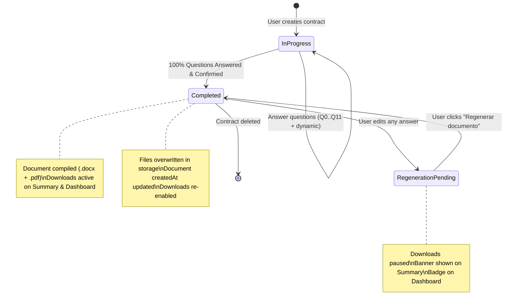

# Data Model Specification: Document Generation

**Branch**: `007-document-generation` | **Date**: 2026-09-16 | **Spec**: [spec.md](./spec.md)

---

## 1. Domain Entities & Value Objects

### 1.1 `ContractGeneration` (Aggregate Root)
Represents the contract generation lifecycle, question answers, completion state, and synchronization with generated documents.

- **Attributes**:
  - `id: ContractId`: Unique contract generation identifier.
  - `userId: UserId`: Owning authenticated user identifier.
  - `title: string`: Contract title (default "Mi Contrato 1", "Mi Contrato 2", etc.).
  - `status: 'in_progress' | 'completed'`: Status indicating questionnaire progress.
  - `currentQuestionIndex: number`: Progress pointer through questions.
  - `answers: Record<string, unknown>`: Key-value map of submitted answers (standard Q0–Q11 + dynamic questions).
  - `createdAt: Date`: Creation timestamp.
  - `updatedAt: Date`: Last modification timestamp (bumped whenever answers or title change).

- **Domain Invariants**:
  - A contract can only transition to `completed` if **100% of questionnaire questions** are answered (`IncompleteQuestionnaireError` thrown otherwise per Clarification 4).
  - Editing answers on a `completed` contract updates `updatedAt` without resetting `status` to `in_progress`, flagging the contract as needing regeneration.

---

### 1.2 `ContractDocument` (Entity)
Represents a generated document file artifact (.docx or .pdf) associated with a contract generation instance.

- **Attributes**:
  - `id: string`: Unique document artifact identifier (UUID).
  - `contractId: string`: Parent contract generation identifier.
  - `userId: string`: Owning user identifier.
  - `fileFormat: 'docx' | 'pdf'`: File format of the document artifact.
  - `storagePath: string`: Path or storage key where the compiled binary is stored.
  - `createdAt: Date`: Timestamp when this version of the document was compiled.

- **Domain Rules & Invariants**:
  - **Single Version Retention (FR-010)**: Only the latest version per `(contractId, fileFormat)` is stored. Re-generating a document replaces the previous file artifact and updates `createdAt`.
  - Enforced at database level via `UNIQUE (contract_id, file_format)`.

---

### 1.3 `AssembledContract` (Domain Model / Value Object)
The intermediate structured representation of the legal agreement compiled from user answers before rendering into Word or PDF format (Clarification 3 / FR-004).

- **Attributes**:
  - `title: string`: Formal contract title (e.g., "CONTRATO DE PRESTACIÓN DE SERVICIOS").
  - `parties`:
    - `client: ContractParty`: Hiring party / Contratante (name, legal personality: natural vs jurídica, address, legal ID).
    - `provider: ContractParty`: Provider / Contratista (name, capacity, personnel & vehicle duties).
  - `declarations: string[]`: Recitals / Antecedentes synthesized from Q0 (good/service description) and Q2 (delivery requirements).
  - `operativeClauses: ContractClause[]`:
    - *Cláusula Primera (Objeto)*
    - *Cláusula Segunda (Condiciones de Entrega y Lugar)*
    - *Cláusula Tercera (Plazo y Vigencia)*
    - *Cláusula Cuarta (Precio y Reajuste)*
    - *Cláusula Quinta (Obligaciones y Recursos)*
    - *Cláusula Sexta (Incumplimiento y Penalidades)*
    - *Cláusula Séptima (Causales de Terminación Anticipada)*
    - *Cláusula Octava (Solución de Controversias)*
  - `dynamicClauses: ContractClause[]`: Specific covenants compiled from dynamic follow-up questions.
  - `signatures`:
    - `clientSignBlock: SignatureBlock`: Designated printed name, ID line, and ink signature line for Contratante.
    - `providerSignBlock: SignatureBlock`: Designated printed name, ID line, and ink signature line for Contratista.

---

### 1.4 `ContractDashboardItemDTO` (Extended Projection)
Projected DTO consumed by the dashboard table to control format dropdown and regeneration badges.

```typescript
export interface ContractDashboardItemDTO {
  id: string;
  userId: string;
  title: string;
  status: 'in_progress' | 'completed';
  currentQuestionIndex: number;
  questionsAnsweredCount: number;
  hasGeneratedDocument: boolean;
  availableFormats: ('pdf' | 'docx')[];
  isRegenerationPending: boolean; // true when answers modified after document generation
  createdAt: Date;
  updatedAt: Date;
}
```

---

## 2. Database Schema (PostgreSQL / Supabase)

### 2.1 Table: `public.contract_documents`
Existing table configured with foreign key cascade and format uniqueness constraint:

```sql
CREATE TABLE IF NOT EXISTS public.contract_documents (
    id UUID PRIMARY KEY DEFAULT gen_random_uuid(),
    contract_id UUID NOT NULL REFERENCES public.contract_generations(id) ON DELETE CASCADE,
    user_id UUID NOT NULL REFERENCES auth.users(id) ON DELETE CASCADE,
    file_format VARCHAR(20) NOT NULL, -- 'pdf' | 'docx'
    storage_path TEXT NOT NULL,
    created_at TIMESTAMPTZ NOT NULL DEFAULT NOW(),
    CONSTRAINT uq_contract_document_format UNIQUE (contract_id, file_format)
);

CREATE INDEX IF NOT EXISTS idx_contract_documents_contract_id ON public.contract_documents(contract_id);
CREATE INDEX IF NOT EXISTS idx_contract_documents_user_id ON public.contract_documents(user_id);

ALTER TABLE public.contract_documents ENABLE ROW LEVEL SECURITY;

CREATE POLICY "Users can view own documents"
    ON public.contract_documents FOR SELECT
    TO authenticated
    USING (auth.uid() = user_id);

CREATE POLICY "Users can insert own documents"
    ON public.contract_documents FOR INSERT
    TO authenticated
    WITH CHECK (auth.uid() = user_id);

CREATE POLICY "Users can update own documents"
    ON public.contract_documents FOR UPDATE
    TO authenticated
    USING (auth.uid() = user_id);

CREATE POLICY "Users can delete own documents"
    ON public.contract_documents FOR DELETE
    TO authenticated
    USING (auth.uid() = user_id);
```

---

## 3. Lifecycle & State Machine



### Transition Invariants
1. `InProgress` -> `Completed`:
   - Validates question completeness: 100% answered.
   - Validates quota: If Free tier, checks if consumed contracts < `getFreeContractLimit()`. If exceeded, blocks with `FreeQuotaExceededError`.
   - Generates `.docx` and `.pdf` buffers.
   - Saves to storage and inserts into `contract_documents`.
2. `Completed` -> `RegenerationPending`:
   - Triggered automatically when `save()` updates `answers` on a completed contract.
   - Evaluated as: `contract.updatedAt > document.createdAt`.
3. `RegenerationPending` -> `Completed`:
   - Triggered when user clicks "Regenerar documento".
   - Generates fresh `.docx` and `.pdf` buffers.
   - Overwrites existing storage paths and updates `created_at` timestamp.
   - **Zero Quota Deduction**: Does not consume additional user quota.
