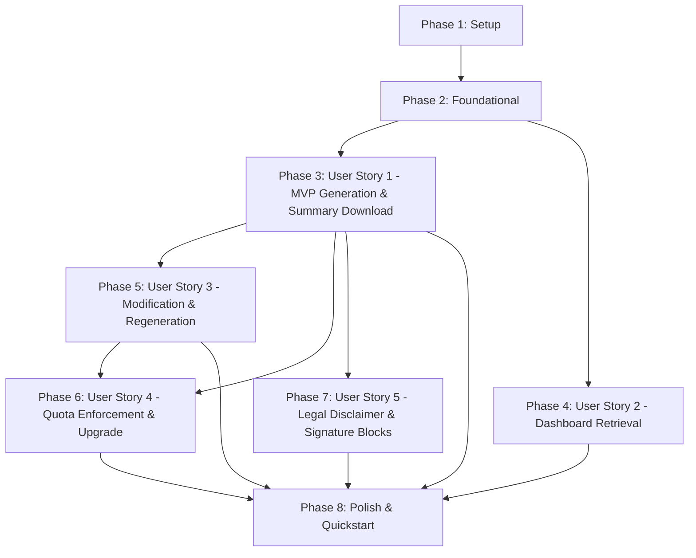

# Tasks: Document Generation

**Branch**: `007-document-generation` | **Date**: 2026-09-16 | **Spec**: [spec.md](./spec.md) | **Plan**: [plan.md](./plan.md)

---

## Phase 1: Setup (Shared Infrastructure)

**Purpose**: Dependency installation, storage bucket configuration, and environment setup

- [X] T001 Install document compilation dependencies `docx`, `pdfkit`, and `@types/pdfkit` in `packages/infrastructure/package.json`
- [X] T002 [P] Configure free quota environment variables `NEXT_PUBLIC_FREE_CONTRACTS_LIMIT` and `FREE_CONTRACTS_LIMIT` in `apps/web/.env.example` and `apps/web/.env.local`
- [X] T003 [P] Document Supabase Storage private bucket configuration for `contracts` bucket and RLS policies in `packages/infrastructure/src/supabase/storage-setup.md`

---

## Phase 2: Foundational (Blocking Prerequisites)

**Purpose**: Core domain entities, error types, formatting utilities, and port abstractions required by all user stories

**⚠️ CRITICAL**: No user story implementation can begin until this foundational phase is complete.

- [X] T004 [P] Define domain error types (`IncompleteQuestionnaireError`, `FreeQuotaExceededError`, `DocumentGenerationError`, `DocumentNotFoundError`) in `packages/domain/src/errors/DomainErrors.ts`
- [X] T005 [P] Implement `ContractDocument` entity and format types in `packages/domain/src/entities/ContractDocument.ts`
- [X] T006 [P] Implement `FreeQuotaConfig` service with fallback defaults in `packages/domain/src/entities/FreeQuotaConfig.ts`
- [X] T007 [P] Implement legal transcript formatting helper in `packages/domain/src/formatters/formatQuestionnaireTranscript.ts`
- [X] T008 [P] Define port interfaces `LlmContractDraftingPort`, `DocumentGeneratorPort`, and `DocumentStoragePort` in `packages/application/src/ports/`
- [X] T009 Update `ContractDashboardItemDTO` and `ContractRepositoryPort` to include `isRegenerationPending` in `packages/application/src/ports/ContractRepositoryPort.ts`
- [X] T010 [P] Implement mock adapters `MockContractDraftingAdapter` and `MockDocumentGeneratorAdapter` in `packages/infrastructure/src/adapters/`
- [X] T011 Implement `SupabaseDocumentStorageAdapter` for saving and retrieving document artifacts in `packages/infrastructure/src/adapters/document/SupabaseDocumentStorageAdapter.ts`
- [X] T012 Update `SupabaseContractRepository` in `packages/infrastructure/src/adapters/storage/SupabaseContractRepository.ts` to compute `isRegenerationPending` by comparing contract and document timestamps
- [X] T013 [P] Centralize Spanish UI copy for disclaimers, format labels, banners, and modals in `apps/web/src/locales/es.ts`

**Checkpoint**: Core foundation ready - user story implementation and testing can now begin.

---

## Phase 3: User Story 1 - Automated Contract Generation & Immediate Download on Summary Screen (Priority: P1) 🎯 MVP

**Goal**: When an authenticated user completes 100% of questionnaire questions and confirms completion on the summary screen, synthesize the contract via LLM, compile `.docx` and `.pdf` files, and provide immediate download buttons on the summary screen.

**Independent Test**: Complete all required questions for a contract generation, confirm completion on the summary review screen, and verify that the document compiles and presents active download controls for both Word (.docx) and PDF (.pdf) formats with files containing the user's answers.

### Tests for User Story 1

> **NOTE: Write these tests FIRST, ensure they FAIL before implementation**

- [X] T014 [P] [US1] Unit tests for `AiContractDraftingAdapter` structured output schema and prompt validation in `packages/infrastructure/tests/adapters/AiContractDraftingAdapter.test.ts`
- [X] T015 [P] [US1] Unit tests for `DocxDocumentGeneratorAdapter` and `PdfDocumentGeneratorAdapter` compilation in `packages/infrastructure/tests/adapters/DocumentGeneratorAdapters.test.ts`
- [X] T016 [P] [US1] Unit test for `GenerateContractDocumentUseCase` validating 100% question completeness gate and compilation orchestration in `packages/application/tests/GenerateContractDocumentUseCase.test.ts`
- [X] T017 [P] [US1] Unit test for `GetContractDocumentDownloadUseCase` verifying storage streaming in `packages/application/tests/GetContractDocumentDownloadUseCase.test.ts`
- [X] T018 [P] [US1] Component tests for summary review screen generation confirmation and download triggers in `apps/web/tests/questionnaire/SummaryReviewGeneration.test.tsx`

### Implementation for User Story 1

- [X] T019 [P] [US1] Implement `AiContractDraftingAdapter` using `@ai-sdk/google` with Gemini and Zod structured schema in `packages/infrastructure/src/adapters/llm/AiContractDraftingAdapter.ts`
- [X] T020 [P] [US1] Implement `DocxDocumentGeneratorAdapter` using `docx` library in `packages/infrastructure/src/adapters/document/DocxDocumentGeneratorAdapter.ts`
- [X] T021 [P] [US1] Implement `PdfDocumentGeneratorAdapter` using `pdfkit` library in `packages/infrastructure/src/adapters/document/PdfDocumentGeneratorAdapter.ts`
- [X] T022 [US1] Implement `GenerateContractDocumentUseCase` in `packages/application/src/use-cases/documents/GenerateContractDocumentUseCase.ts` (depends on T019, T020, T021)
- [X] T023 [US1] Implement `GetContractDocumentDownloadUseCase` in `packages/application/src/use-cases/documents/GetContractDocumentDownloadUseCase.ts`
- [X] T024 [US1] Implement API endpoint `POST /api/contracts/[id]/complete` in `apps/web/src/app/api/contracts/[id]/complete/route.ts`
- [X] T025 [US1] Implement API endpoint `GET /api/contracts/[id]/download` streaming `.docx` and `.pdf` files in `apps/web/src/app/api/contracts/[id]/download/route.ts`
- [X] T026 [US1] Update `SummaryReview.tsx` in `apps/web/src/components/questionnaire/SummaryReview.tsx` to handle generation triggering, loading state (`aria-busy="true"`), and accessible download controls

**Checkpoint**: User Story 1 complete and independently testable as an MVP.

---

## Phase 4: User Story 2 - Contract Retrieval from the Dashboard Across Formats (Priority: P1)

**Goal**: Enable users to download finalized contracts in Word or PDF from the dashboard via a format dropdown menu, disabled with guidance if not yet generated, or showing an "Actualización pendiente" badge if answers were modified.

**Independent Test**: Navigate to the dashboard with an account owning completed contracts, open the "Descargar" menu for a contract row, and verify that selecting either PDF or Word initiates a download of the corresponding file.

### Tests for User Story 2

- [X] T027 [P] [US2] Component tests for `DownloadDropdown` and `ContractTableRow` download column in `apps/web/tests/components/DownloadDropdown.test.tsx`

### Implementation for User Story 2

- [X] T028 [P] [US2] Implement accessible `DownloadDropdown` component with keyboard navigation and format selection in `apps/web/src/components/dashboard/DownloadDropdown.tsx`
- [X] T029 [US2] Update dashboard row component in `apps/web/src/components/dashboard/ContractTableRow.tsx` to render `DownloadDropdown` or disabled download state
- [X] T030 [US2] Integrate document download triggers into dashboard list view in `apps/web/src/app/(dashboard)/dashboard/page.tsx`

**Checkpoint**: User Stories 1 AND 2 work independently.

---

## Phase 5: User Story 3 - Answer Modification and Document Regeneration (Priority: P1)

**Goal**: When a user modifies an answer on an already-completed contract, pause downloads, display an "Actualización pendiente" banner with a "Regenerar documento" action on the summary screen and a badge on the dashboard, and overwrite previous `.docx` and `.pdf` files upon regeneration with zero quota penalty.

**Independent Test**: Open a completed contract with existing generated documents, modify an answer, verify downloads are disabled with banner, trigger document regeneration, and download updated Word and PDF files to verify that modified answers are reflected and previous files are cleanly overwritten.

### Tests for User Story 3

- [X] T031 [P] [US3] Unit test for `RegenerateContractDocumentUseCase` verifying answer re-synthesis, single version overwrite, and zero quota deduction in `packages/application/tests/RegenerateContractDocumentUseCase.test.ts`
- [X] T032 [P] [US3] Component tests for answer modification, regeneration banner, and download re-enablement in `apps/web/tests/questionnaire/SummaryReviewRegeneration.test.tsx`

### Implementation for User Story 3

- [X] T033 [US3] Implement `RegenerateContractDocumentUseCase` in `packages/application/src/use-cases/documents/RegenerateContractDocumentUseCase.ts`
- [X] T034 [US3] Implement API endpoint `POST /api/contracts/[id]/regenerate` in `apps/web/src/app/api/contracts/[id]/regenerate/route.ts`
- [X] T035 [US3] Update `SummaryReview.tsx` in `apps/web/src/components/questionnaire/SummaryReview.tsx` to display the "Actualización pendiente" banner, pause downloads when answers modified, and trigger regeneration
- [X] T036 [US3] Update dashboard contract row in `apps/web/src/components/dashboard/ContractTableRow.tsx` to render the "Actualización pendiente" badge linking to `/questionnaire?id={id}&mode=summary`

**Checkpoint**: User Stories 1, 2, and 3 work independently and cohesively.

---

## Phase 6: User Story 4 - Free Account Quota Enforcement and Pro Plan Upgrade (Priority: P2)

**Goal**: Enforce contract creation limits on Free accounts based on environment variables while giving Pro accounts unlimited access, prompting free users to upgrade via `/checkout` when their limit is reached, while exempting regenerations of existing contracts.

**Independent Test**: Configure a free limit (e.g., limit = 2), create and complete contracts up to that limit, and verify that an attempt to complete a subsequent new contract halts generation, displays a quota limit notification, and presents a direct link to `/checkout`, while regenerations on existing contracts proceed without penalty.

### Tests for User Story 4

- [ ] T037 [P] [US4] Unit tests for quota evaluation in `GenerateContractDocumentUseCase` and exemption in `RegenerateContractDocumentUseCase` in `packages/application/tests/ContractQuotaEnforcement.test.ts`
- [ ] T038 [P] [US4] Component tests for quota limit notification modal and checkout CTA link in `apps/web/tests/components/QuotaUpgradeModal.test.tsx`

### Implementation for User Story 4

- [ ] T039 [US4] Integrate `FreeQuotaConfig` validation in `GenerateContractDocumentUseCase` in `packages/application/src/use-cases/documents/GenerateContractDocumentUseCase.ts`
- [ ] T040 [US4] Implement `QuotaUpgradeModal` in `apps/web/src/components/modals/QuotaUpgradeModal.tsx` linking to `/checkout`
- [ ] T041 [US4] Integrate quota modal handling in summary review view in `apps/web/src/components/questionnaire/SummaryReview.tsx` upon receiving `FREE_QUOTA_EXCEEDED` error

**Checkpoint**: Quota enforcement and upgrade flow fully functional.

---

## Phase 7: User Story 5 - Legal Advice Disclaimer in UI & Clean Signature-Ready Document (Priority: P2)

**Goal**: Clearly inform the user prior to document generation that generated content does not constitute legal advice, and produce a clean document body concluding with formatted physical/ink signature blocks for both parties without platform disclaimer notices inside the contract.

**Independent Test**: Open the contract summary review screen, verify that the mandatory Spanish legal disclaimer is prominently displayed before generation is confirmed, and then inspect the generated Word and PDF documents to confirm that the contract text is clean of platform disclaimers and concludes with formatted signature blocks for each party.

### Tests for User Story 5

- [ ] T042 [P] [US5] Unit tests verifying that LLM prompt and document generators omit platform disclaimers and include structured signature blocks in `packages/infrastructure/tests/adapters/ContractAnatomyAndSignatures.test.ts`
- [ ] T043 [P] [US5] Component and accessibility tests for the Spanish legal advice disclaimer callout (`role="note"`) in `apps/web/tests/questionnaire/LegalDisclaimerCallout.test.tsx`

### Implementation for User Story 5

- [ ] T044 [US5] Update `SummaryReview.tsx` in `apps/web/src/components/questionnaire/SummaryReview.tsx` to render the prominent Spanish legal advice disclaimer callout before the confirmation action
- [ ] T045 [US5] Verify signature block rendering for Contratante and Contratista (printed name, ID line, date) in `DocxDocumentGeneratorAdapter.ts` and `PdfDocumentGeneratorAdapter.ts`

**Checkpoint**: All user stories implemented and verified.

---

## Phase 8: Polish & Cross-Cutting Concerns

**Purpose**: Accessibility validation, special character resilience, and full verification

- [ ] T046 [P] Automated accessibility audit (WCAG 2.1 AA) for all document generation and download controls in `apps/web/tests/a11y/DocumentGenerationA11y.test.tsx`
- [ ] T047 [P] Special characters and long open-text edge case tests in `packages/infrastructure/tests/adapters/SpecialCharactersAndEdgeCases.test.ts`
- [ ] T048 End-to-end verification of all 6 scenarios in `specs/007-document-generation/quickstart.md`
- [ ] T049 Run monorepo typecheck, linting, and test suite across all workspace packages via `package.json` scripts (`pnpm test && pnpm typecheck && pnpm lint`)

---

## Dependencies & Execution Order

### Phase Dependencies

- **Setup (Phase 1)**: No dependencies - can start immediately.
- **Foundational (Phase 2)**: Depends on Setup completion - BLOCKS all user stories.
- **User Story 1 (Phase 3 - MVP)**: Depends on Foundational completion.
- **User Story 2 (Phase 4)**: Depends on Foundational completion; integrates with US1 download API.
- **User Story 3 (Phase 5)**: Depends on US1 completion (extends generation to handle answer edits and regeneration).
- **User Story 4 (Phase 6)**: Depends on US1 and US3 completion (enforces quota on initial completion, permits regeneration).
- **User Story 5 (Phase 7)**: Depends on US1 completion (refines summary UI disclaimer and document signature anatomy).
- **Polish (Phase 8)**: Depends on all user stories being complete.

### User Story Dependencies



### Within Each User Story

- TDD Tests MUST be written FIRST and fail before implementation code is written.
- Models and formatters before services.
- Ports and adapters before use cases.
- Use cases before API routes.
- API routes before UI component integration.
- Story complete and independently testable before moving to dependent stories.

### Parallel Opportunities

- **Phase 1 (Setup)**: T002 and T003 can execute in parallel.
- **Phase 2 (Foundational)**: T004, T005, T006, T007, T008, T010, and T013 can execute in parallel.
- **Phase 3 (User Story 1)**:
  - Tests T014, T015, T016, T017, T018 can execute in parallel.
  - Adapters T019, T020, T021 can execute in parallel once tests fail.
- **Phase 4 (User Story 2)**: T027 and T028 can execute in parallel.
- **Phase 5 (User Story 3)**: T031 and T032 can execute in parallel.
- **Phase 6 (User Story 4)**: T037 and T038 can execute in parallel.
- **Phase 7 (User Story 5)**: T042 and T043 can execute in parallel.
- **Phase 8 (Polish)**: T046 and T047 can execute in parallel.

---

## Parallel Example: User Story 1

```bash
# Launch test tasks for User Story 1 together:
Task: "Unit tests for AiContractDraftingAdapter in packages/infrastructure/tests/adapters/AiContractDraftingAdapter.test.ts"
Task: "Unit tests for DocxDocumentGeneratorAdapter and PdfDocumentGeneratorAdapter in packages/infrastructure/tests/adapters/DocumentGeneratorAdapters.test.ts"
Task: "Unit test for GenerateContractDocumentUseCase in packages/application/tests/GenerateContractDocumentUseCase.test.ts"

# Launch generator adapters for User Story 1 together:
Task: "Implement DocxDocumentGeneratorAdapter in packages/infrastructure/src/adapters/document/DocxDocumentGeneratorAdapter.ts"
Task: "Implement PdfDocumentGeneratorAdapter in packages/infrastructure/src/adapters/document/PdfDocumentGeneratorAdapter.ts"
```

---

## Implementation Strategy

### MVP First (User Story 1 Only)

1. Complete Phase 1: Setup (`docx`, `pdfkit`, environment variables).
2. Complete Phase 2: Foundational (Entities, error types, ports, mock adapters, Spanish copy).
3. Complete Phase 3: User Story 1 (TDD tests, LLM drafting adapter, Word & PDF generators, use cases, API routes, summary review download controls).
4. **STOP and VALIDATE**: Verify Scenario 1 from `quickstart.md` (contract generates and downloads in `.docx` and `.pdf` upon 100% completion).

### Incremental Delivery

1. **Increment 1 (MVP)**: Setup + Foundational + User Story 1 → Users can complete questionnaires and download Word & PDF contracts directly on the summary screen.
2. **Increment 2**: User Story 2 → Users can retrieve generated documents from the dashboard anytime.
3. **Increment 3**: User Story 3 → Users can modify answers on completed contracts and regenerate updated documents with zero version clutter.
4. **Increment 4**: User Story 4 → Free quota limits are enforced with upgrade prompts to `/checkout`, exempting regenerations.
5. **Increment 5**: User Story 5 → Spanish legal advice disclaimer is clearly positioned before generation, and generated documents have clean signature blocks.
6. **Increment 6**: Polish → WCAG 2.1 AA accessibility audit, Spanish character robustness, and full quickstart verification.

---

## Notes

- All tasks follow strict checklist format: `- [ ] [TaskID] [P?] [Story?] Description with file path`.
- All user-facing UI text, disclaimers, badges, and contract clauses are strictly localized in Spanish (`es`) in `apps/web/src/locales/es.ts`.
- Code identifiers, port names, test filenames, and documentation are strictly in English.
- Pure JavaScript compilation via `docx` and `pdfkit` (no headless browser or heavy native dependencies).
